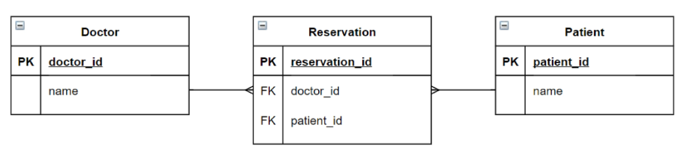
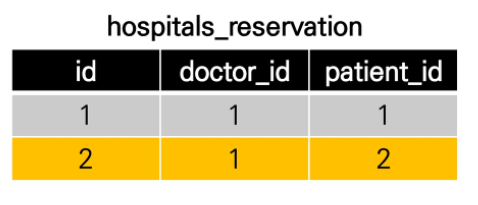
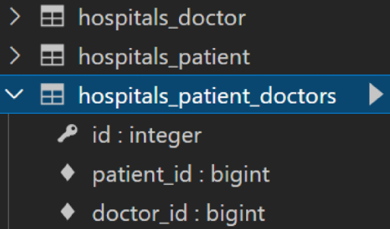

# 0418_DB


## Model relationship


## M:N 관계 학습

- 병원 진료 기록 시스템을 통한 M:N 관계 학습하기


- 병원 시스템에서 가장 핵심이 되는 객체인 환자와 의사의 관계를 표현하여 병원 진료 기록 시스템 구축하기
- **모델링은 현실 세계를 최대한 유사하게 반영하기 위한 것**
- 우리 일상에 가까운 예시를 통해 DB를 모델링하고, 그 내부에서 일어나는 데이터의 흐름을 어떻게 제어할 수 있을지 고민해보자.


### 1:N 모델의 한계

1 : N 모델 관계 설정 코드

```python
from django.db import models


class Doctor(models.Model):
    name = models.TextField()

    def __str__(self):
        return f'{self.pk}번 의사 {self.name}'


class Patient(models.Model):
    doctor = models.ForeignKey(Doctor, on_delete=models.CASCADE)
    name = models.TextField()

    def __str__(self):
        return f'{self.pk}번 환자 {self.name}'
```

한 번에 두 의사에게 진료를 받고자 하는 경우, 하나의 외래 키에 2개의 의사 데이터를 넣을 수 없음

따라서 1:N 모델에는 아래와 같은 한계가 존재한다.

- 새로운 예약을 생성하는 것이 불가능하다.
  - 새로운 객체를 생성해야 한다.
- 여러 의사에게 진료 받은 기록을 환자 한 명에게 저장할 수 없다.
  - 외래 키에 '1, 2' 형식의 데이터를 사용할 수 없기 때문.


### 중개 모델 사용해 보기

중개 모델(중개 테이블) 사용 코드

```python
class Doctor(models.Model):
    name = models.TextField()

    def __str__(self):
        return f'{self.pk}번 의사 {self.name}'


# 외래키 삭제
class Patient(models.Model):
    name = models.TextField()

    def __str__(self):
        return f'{self.pk}번 환자 {self.name}'

# 중개모델 작성
class Reservation(models.Model):
    doctor = models.ForeignKey(Doctor, on_delete=models.CASCADE)
    patient = models.ForeignKey(Patient, on_delete=models.CASCADE)

    def __str__(self):
        return f'{self.doctor_id}번 의사의 {self.patient_id}번 환자'
```


이 경우에는 아래와 같은 erd로 표현할 수 있다.




모델 `Reservation`은 중개 모델(중개 테이블)의 역할을 한다.

의사 한 명에게 두 명의 환자가 예약했을 때, 중개 모델은 아래와 같은 값을 가지게 된다.




### ManyToManyField

- **다대다 (M:N, many-to-many) 관계 설정 시 사용하는 모델 필드**
- **하나의 필수 위치인자(M:N 관계로 설정할 모델 클래스)가 필요**


ManyToManyField 사용 코드

```python
class Doctor(models.Model):
    name = models.TextField()

    def __str__(self):
        return f'{self.pk}번 의사 {self.name}'


class Patient(models.Model):
    # ManyToManyField 작성
    doctors = models.ManyToManyField(Doctor)
    name = models.TextField()

    def __str__(self):
        return f'{self.pk}번 환자 {self.name}'
```


DB의 중개 테이블은 아래와 같이 생성된다.

*앱이름\_클래스이름\_지정한 필드이름*




