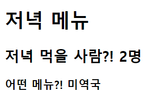

# 0302_workshop


## 결과 사진




## 1. intro/urls.py

```python
from django.contrib import admin
from django.urls import path
from pages import views

urlpatterns = [
    path('admin/', admin.site.urls),
    path('dinner/<str:name>/<int:count>', views.dinner),
]
```


## 2. pages/views.py

```python
from email import message
from django.shortcuts import render

# Create your views here.

def dinner(request, name, count):
    context = {
        'name' : name,
        'count' : count,
    }
    return render(request, 'dinner.html', context)
```


## 3. templates/dinner.html

```html
<!DOCTYPE html>
<html lang="en">
<head>
  <meta charset="UTF-8">
  <meta http-equiv="X-UA-Compatible" content="IE=edge">
  <meta name="viewport" content="width=device-width, initial-scale=1.0">
  <title>Document</title>
</head>
<body>
  <h1>저녁 메뉴</h1>
  <h2>저녁 먹을 사람?! {{count}}명</h2>
  <h3>어떤 메뉴?! {{name}}</h3>
</body>
</html>
```

