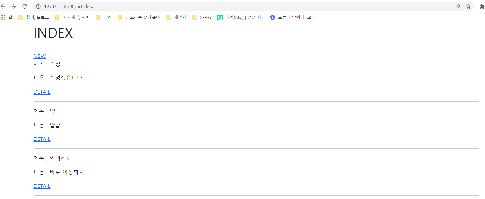
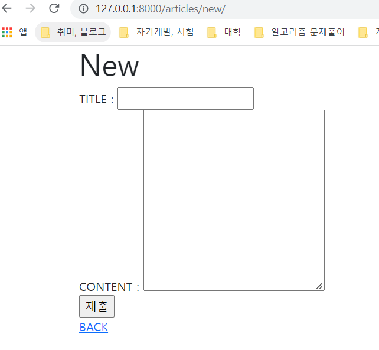

# 0309_workshop


## url.py

```python
from django.urls import path
from . import views

app_name = 'articles'
urlpatterns = [
    path('', views.index, name='index'),
    path('new/', views.new, name='new'),
    path('create/', views.create, name='create'),
```


## view.py

```python
from django.shortcuts import redirect, render
from .models import Article

# Create your views here.

def index(request):
    articles = Article.objects.all()[::-1]

    context = {
        'articles' : articles
    }

    return render(request, 'articles/index.html', context)


def new(request):

    return render(request, 'articles/new.html')


def create(request):
    title = request.POST.get('title')
    content = request.POST.get('content')

    article = Article()
    article.title = title
    article.content = content
    article.save()

    # return render(request, 'articles/index.html')
    return redirect('articles:detail', article.pk)
```


## template\articles


### index.html

```html




  <h1>INDEX</h1>
  <hr>
  <a href=""></a>
  
    <p>제목 : {{ article.title }}</p>
    <p>내용 : {{ article.content }}</p>
    <a href=" ">DETAIL</a>
    
    <hr>
  


```


### new.html

```html




  <h1>New</h1>

  <form action="" method="POST">
    
    <label for="totle">TITLE :</label>
    <input type="text" name="title" id="title"><br>
    <label for="content">CONTENT :</label>
    <textarea name="content" id="content" cols="30" rows="10"></textarea><br>
    

    <input type="submit">
    <a href="">BACK</a>
  </form>


```


## model.py

```python
from django.db import models

# Create your models here.

class Article(models.Model):
    title = models.CharField(max_length=30)
    content = models.TextField()
    created_at = models.DateTimeField(auto_now_add=True)
    updated_at = models.DateTimeField(auto_now=True)
```


## 이미지


### 1) Read




### 2) Create


