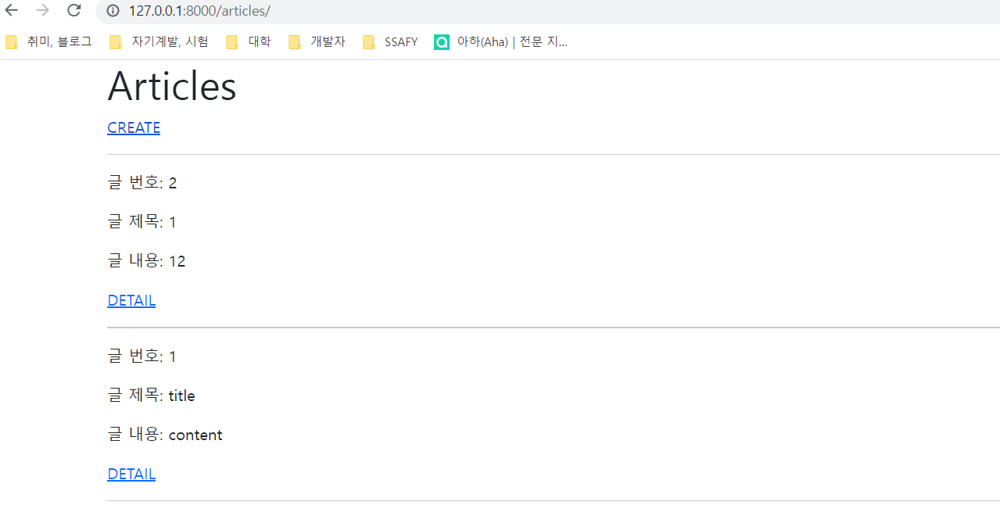
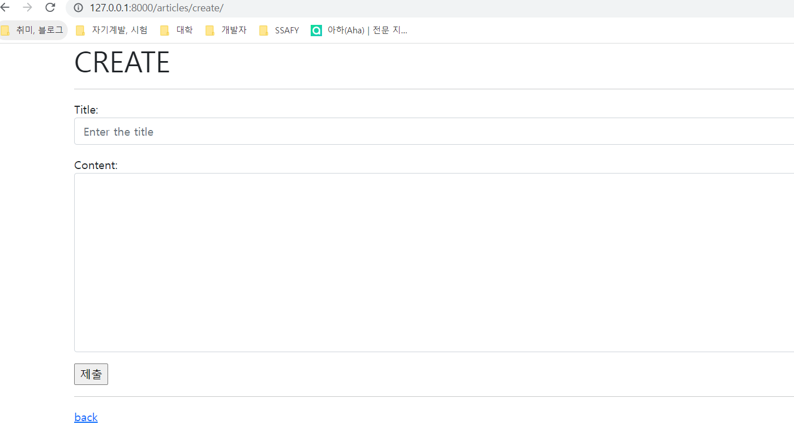
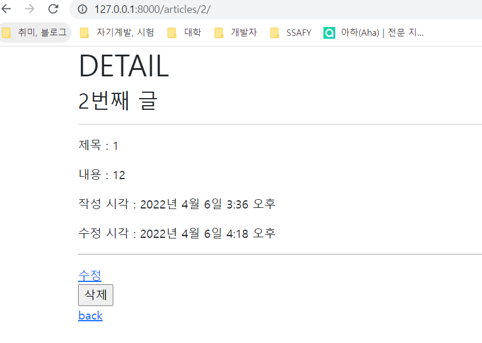

# 0406_workshop


## 결과 사진











## 코드


### url

```python
from django.urls import path
from . import views


app_name = 'articles'
urlpatterns = [
    path('', views.index, name='index'),
    path('create/', views.create, name='create'), # GET / POST
    path('<int:pk>/', views.detail, name='detail'),
    path('<int:pk>/delete/', views.delete, name='delete'),
    path('<int:pk>/update/', views.update, name='update'), # GET / POST
]
```


### view

```python
from django.shortcuts import render, redirect
from .models import Article
from .forms import ArticleForm

# Create your views here.
def index(request):
    articles = Article.objects.order_by('-pk')
    context = {
        'articles': articles,
    }
    return render(request, 'articles/index.html', context)


# def new(request):
#     form = ArticleForm()
#     context = {
#         'form': form,
#     }
#     return render(request, 'articles/new.html', context)


def create(request):
    if request.method == 'POST':
        # create
        form = ArticleForm(request.POST)
        if form.is_valid():  # 유효성 검사
            article = form.save()
            return redirect('articles:detail', article.pk)
        # print(form.errors)
    else:
        # new
        form = ArticleForm()
    context = {
        'form': form,
    }
    return render(request, 'articles/create.html', context)


def detail(request, pk):
    article = Article.objects.get(pk=pk)
    context = {
        'article': article,
    }
    return render(request, 'articles/detail.html', context)


def delete(request, pk):
    article = Article.objects.get(pk=pk)
    if request.method == 'POST':
        article.delete()
        return redirect('articles:index')
    return redirect('articles:detail', article.pk)


# def edit(request, pk):
#     article = Article.objects.get(pk=pk)
#     context = {
#         'article': article,
#     }
#     return render(request, 'articles/edit.html', context)


def update(request, pk):
    article = Article.objects.get(pk=pk)
    if request.method == 'POST':
        # update
        form = ArticleForm(request.POST, instance=article)
        if form.is_valid():  # 유효성 검사
            article = form.save()
            return redirect('articles:detail', article.pk)
    else:
        # edit
        form = ArticleForm(instance=article)
    context = {
        'article': article,
        'form': form,
    }
    return render(request, 'articles/update.html', context)
```


### template

#### Create

```html




  <h1>CREATE</h1>
  <hr>
  <form action="" method="POST">
    
    {{ form.as_p }}
    <input type="submit">
  </form>
  <hr>
  <a href="">back</a>


```

#### Detail

```html



  <h1>DETAIL</h1>
  <h3>{{ article.pk }}번째 글</h3>
  <hr>
  <p>제목 : {{ article.title }}</p>
  <p>내용 : {{ article.content }}</p>
  <p>작성 시각 : {{ article.created_at }}</p>
  <p>수정 시각 : {{ article.updated_at }}</p>
  <hr>
  <a href="">수정</a>
  <form action="" method="POST">
    
    <input type="submit" value="삭제">
  </form>
  <a href="">back</a>

```


#### index

```html




  <h1>Articles</h1>
  <a href="">CREATE</a>
  <hr>
  
    <p>글 번호: {{ article.pk }}</p>  
    <p>글 제목: {{ article.title }}</p>
    <p>글 내용: {{ article.content }}</p>
    <a href="">DETAIL</a>
    <hr>
  

```


### model

```python
from django.db import models

# Create your models here.
class Article(models.Model):
    title = models.CharField(max_length=10)
    content = models.TextField()
    created_at = models.DateTimeField(auto_now_add=True)
    updated_at = models.DateTimeField(auto_now=True)

    def __str__(self):
        return self.title
```


