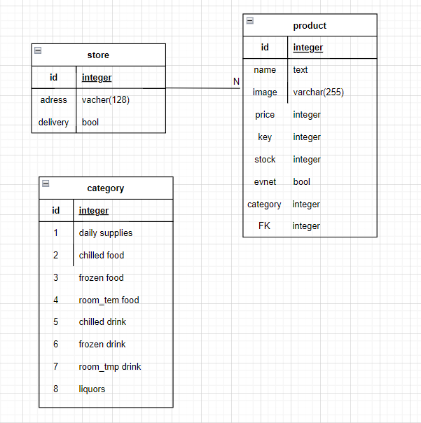

# 0414_homework





```python
from django.db import models
from django.conf import settings

# Create your models here.
class Store(models.Model):
    name = models.CharField(max_length=128)
    adress = models.CharField(max_length=128)
    delivery = models.BooleanField()

    def __str__(self):
        return self.name


class Product(models.Model):

    name = models.TextField
    image = models.CharField(max_length=255)
    price = models.IntegerField
    key = models.IntegerField
    stock = models.IntegerField
    category = models.IntegerField
    event = models.BooleanField
    store = models.ForeignKey(Store, on_delete=models.CASCADE)

    def __str__(self):
        return self.name

```


각 지점과 보유 상품을 연결한 다음에 카테고리별로 번호를 부여하려 했다.
