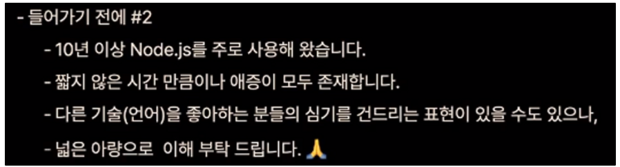
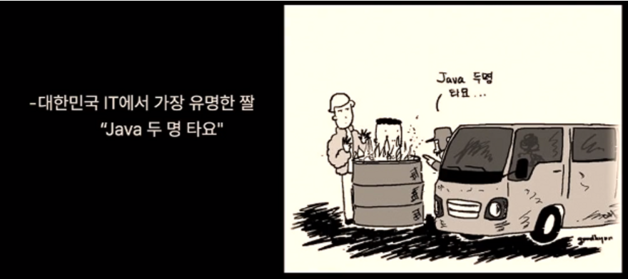
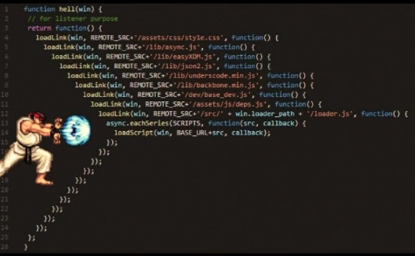
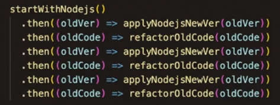
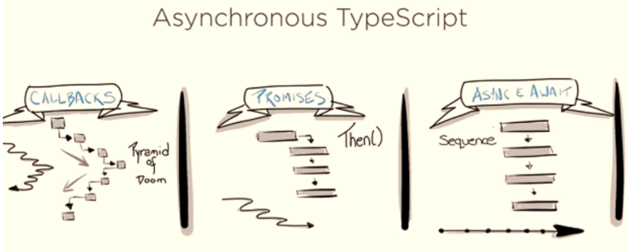

# 언어와 함께 성장하기

## Node.js와 10년, v0.8부터 v16까지

<aside> 💡 Flitto **강동한**

Flitto에서 Node.js로 10년째 언어 서비스를 만들고 있습니다.

</aside>

> Node.js를 활용한 Flitto 서비스는 ‘언어의 장벽을 넘어서’라는 슬로건으로 10년 동안 발전해 온 서비스입니다. Node.js v0.8로 서비스를 시작하여, 2022년 현재 LTS인 v16으로 서비스하고 있습니다. 플리토가 10여 년 동안 Node.js와 함께 성장해 온 이야기를 들려드리려 합니다.


## 1. Introduction

들어가기 전에 #1

- Node.js는 JavaScript 언어의 런타임입니다.

  - Node.js가 비교적 짧은 시간 동안 많은 버전업을 통해 성장하였고,
  - 그동안 이 기술을 이용하여 언어 서비스를 만들어왔기 때문에,

- 이를 빗대서 

  ```
  언어와 함께 성장하기
  ```

   라는 말로 포괄적으로 표현했습니다.

  - Node.js 언어 아니잖아?! → 넓은 마음 부탁..

들어가기 전에 #2




## 2. 왜 Node.js인가

Flitto는 Node.js를 주로 사용하여, 2012년부터 개발 및 서비스 해왔습니다.

처음 서비스를 시작할때는 v0.8.6이었는데,

현재는 v16.16.0을 적용하고 있습니다.

왜 JS인가요?

- 사실 특별한 이유는 없습니다.
- 그냥 쿨해보여서 했습니다...
- FE와 BE를 같은 언어로 할 수 있어요 (라고 합리화 중)

### Node.js 현실

\#1



짤에서조차 자바만 찾는다..

\#2

엄청 많은 사람들이 자바만 찾는다.. 강의조차..

> > 하지만 우리는 전향하지 않고 이 언어의 전문가가 되기로 했다.

## 3. 언어와 함께 성장하기

### 시작

막 Node.js가 핫해질 시점.. 당시 최신 버전은 v0.8.6.. 믿음이 가지 않았다.

but Start-up에 최적화 된 기술이었다.

BE와 FE를 같은 언어로 개발할 수 있고,

초기에 비교적 적은 비용으로 서버 구축이 가능합니다.

JS할 줄 아는 사람을 뽑아서 적성에 따라 BE FE를 다 시켜..

### 언어의 성장 과정과 함께 하다

Callback Hell을 아시나요?



끝없는 함수 부르기

이로 인해 Promise가 나오게 되었다.



이렇게 리팩토링이 된다.

but 다른 언어 진영에서 비판을 했다.

그래서 async / await 가 나오게 됐다.



이런 새로운 게 나올 때마다 열심히 리팩토링을 했다

### 서툰 목수가 연장 탓 그만할래요

잠시 우리의 행동을 뒤돌아 봅시다.

새로운 기술이 나왔어! → 공부해 보자! → 스터디 몇번 하고 그만둠 *99

특정 기술을 잠깐 경험하고, 다른 거 기웃기웃..

대량의 데이터를 다룰 때, Node.js로 작업하다가 성능적 한계를 느꼈다.

주변 추천으로 go언어로 잠깐 전향을 했다.

당시 go언어는 해당 작업을 위해 사용할 라이브러리가 잘 보이지 않았다.

다시 Node.js로 돌아와서 Stream으로 손쉽게 해결

이 경우는, 서툰 목수가 연장 탓만 하는 경우였다.

남들보다 오래 사용했지만, 아직도 잘 하는 것 같지는 않다.

그렇다고 Node.js만 쓴느 게 아니라 다른 언어도 많이 사용한다.

python, julia, java… 씁니다.

### 언어가 계속 발전해요

버전업에 대해 할말은 많지만 많이 버전업 했어요

누군가는 너무 자주 바뀐다고 푸념을 한다.

안정화가 안되었다고도 말한다.

하지만, 그걸 빠르게 개선이 이루어진다고 생각을 바꿔보면 어떨까?

버전업이 빠르다 보니 그 자체가 루틴화가 되었다

버전업을 하며 전반적인 리팩토링을 진행하려 노력한다

어차피 작업하는김에 라이브러리, os패키지 및 버전도 업데이트를 한다

컨테이너나 람다를 적극 활용해서 버전업의 부담을 줄이도록 노력한다

오랫동안 업데이트하지 않는 서버 vs 자주 업데이트 하는 서버

→ 각자의 머릿속에서 뭐가 더 좋을지 생각해보세요.

### 너무 잘 죽어요

너무 잘 죽어.. 그거 못써..

이런 문제에서 자유롭진 않습니다.

그냥 죽는 건 없고 개발자의 잘못이 항상 있습니다..

언제나 죽을 수 있다는 가정하에 작업을 합니다.

빠르게 인지하고, 개선하고, 적용하는 것을 추구합니다.

이 문제의 경우 자동화 테스트를 구가하고요.

어떻게 보면, 문제를 빠르게 알 수 있지 않을까요?

### 우리 언어가 달라졌어요

- 자바스크립트에 대한 비판
  - 동적 타이핑은 불안하다
  - 런타임에서 문제가 발견되는 경우

→ 정적 언어의 장점까지 흡수한 TS의 등장!

Angular및 NextJS를 통해 TS를 사용하기 시작했습니다.

지금은 TS의 시대!

### 언어의 한계도 개선이 되어가요

Node.js의 내장 http 성능이 안좋다고 시작된 프로젝트 undici

벤치마킹 결과를 보면 성능이 월등히 좋음

테스트 해보고 서비스에 적용해봤더니 왕창 좋아짐

lambda 함수 등에서 응답시간이 감소 → 비용 절감 효과를 얻음!

### Infra와 함께 발전하기

Flitto 서비스 초기에는 AWS ec2 위주로 서비스 시작

AWS에서 새로 나오는 기능/서비스에 Node.js는 대부분 첫 버전에 포함 및 특별한 설정이 필요 없음

- Lambda, LightSail 등

Container 형태로 만들기도 비교적 수월하다

- K8s(EKS)로 인프라 진화
- AWS SDK를 BE/FE에서 같이 사용 가능
  - cf> AWS SDK for JS V3은 많은 면에서 개선되어 나옴

### 무한 삽질

언제나처럼 4월이 되어서 Node.js 새 버전 발표가 됨

→ 에러 발생

→ 오잉 테스트 코드에는 문제가 없는데.?

파일 시스템에 문제가 있는 거야!

⇒ 오픈소스를 고쳐 볼까..?

⇒ opensource contributor가 되었다 !!

내가 사용하는 기술의 컨트리뷰터가 될 수 있는 기회

`저 오픈 소스에 관심 있는 사람이에요` 말만 하는 게 아닌,

업무를 하면서 성장하고 기여하게 된 것이라 더욱 의미있다고 생각한다.

컨트리뷰터가 되려면 언어의 장벽이 길어요.

리드미도 읽어야 하고, 코딩 언어도 읽어야 해요.

나중에 오픈소스 기여하실 때 테스트 코드도 같이 올려보세요.

## 4. Conclusion

### 언어와 함께 성장하기

- 언어의 성장이 빠르니, 저도 언어와 함께 성장해 왔습니다.
- Node.js와 함께 10년을 해왔습니다.
- 언어 서비스를 만들며 성장해 왔습니다.
- 계속 언어와 함께 성장하려 합니다.

미성숙한 기술과 함께라면 삽질을 많이 해야 하지만, 언어와 함께 성장할 수 있습니다.

### 기술의 선택

많은 언어나 기술들이 갑자기 인기를 끌다가 식고는 합니다.

그런데, 어떤 기술이 유망한가요?

내가 선택한 마이너 기술이 메이져가 될 수 있을까요?

그것은 `운` 입니다.

그렇지만, 우리나라도 IT기술 혹은 언어가 다양해지고 고르게 발전하면 좋겠습니다.

난 어떤 기술을 좋아한다, 어떤 기술이 좋다, 나쁘다 등의 말을 듣게 된다.

그 기술을 머릿속에 한번 떠올려봐라.

그 기술을 무엇을 위해 사용하려고 하는가?

대부분의 경우에 기술은 수단이지 목적이 아니다.

어느 기술에 국한되고 매몰되기 보다는, 우리가 무엇을 하고 싶은지를 먼저 생각하면 좋겠습니다.

세상에 의미있는 일을 하며 성장합시다.


------

# **Realization**

항상 Node.js를 사용하면서도 어떤 것인지 잘 모르고 관심도 없었다.

이 강연을 통해서 조금 관심이 생겼다.

내가 사용하는 기술인 만큼 조금 관심을 가지고 공부해 보아야겠다.

언어를 어떻게 선택하는지에 관해서 고민이 많았다. 프론트, 백엔드를 선택하는 데에도 늘 고민하듯이 취업 등의 문제와 엮어서 언어와 기술을 항상 생각해 왔다.

지금 당장은 반드시 그래야 하는 게 맞지만, 앞으로 계속해서 그런 시선으로 기술을 바라보아서는 안된다는 생각이 들었다. 상황과 조건은 기술의 일부일 뿐이고, 나는 어떠한 도구를 사용하는 사람으로써 그 도구를 있는 그대로 바라볼 줄 알아야 한다.

새로운 것을 좋아하는 성격 때문에 흥미로운 기술이 나올 때마다 기웃거릴 뻔했다. 다른 우물을 바라보는 건 내가 파고 있는 우물을 충분히 깊게 만들면서 해야 할 일이라는 것을 다시 명심하게 되었다.

회사를 차리고 이끌어 나갈 때, 변화가 많은 것을 지레 겁먹어해서는 안되겠다는 생각을 했다. 나는 특별히 미성숙한 언어를 선택해서 반드시 함께 성장하고자 하는 생각은 없지만, 현재 내가 공부하고 사용하는 언어가 발전할 때 그것을 잘 공부해서 함께 성장해야겠다는 생각을 했다.
