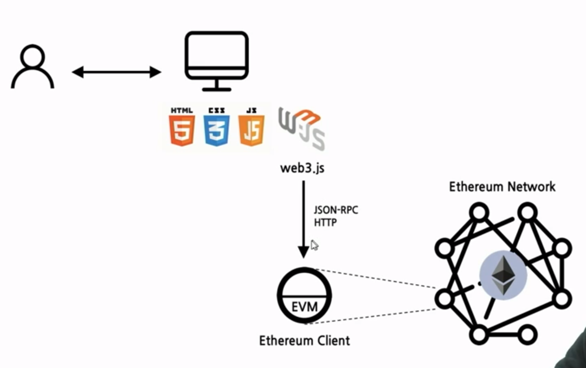
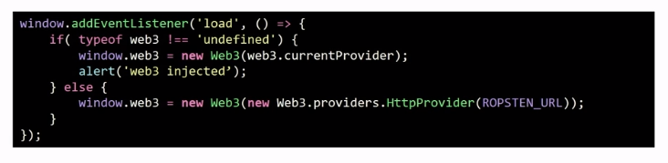
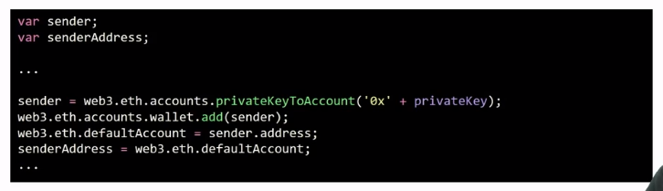
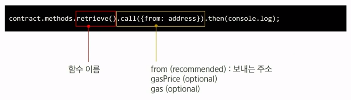
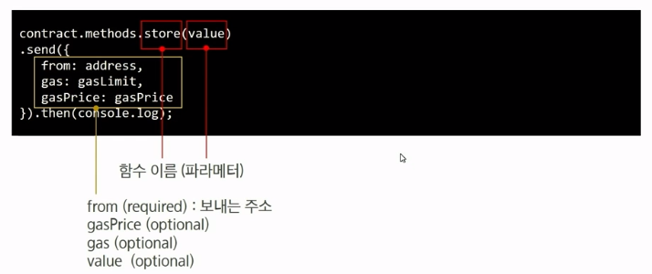

# First DApp

Web3를 이용하여 이더리움과 상호작용하기

## DApp - Decentralized Application

탈중앙화된 P2P 네트워크 상에 백엔드 로직이 구동되는 응용프로그램

- 블록체인 상의 스마트 컨트랙트가 기존의 중앙화된 서버에 의해 서비스를 제공하는 시스템 대체
- 즉, 백엔드를 블록체인으로 사용

좀 더 좁은 의미에서 DApp은 사용자 인터페이스를 통해 블록체인의 스마트 컨트랙트를 호출함으로써 동작하는 응용프로그램

DApp = Frontend + Smart Contract on Blockchain

## DApp 구성 요소

1. 스마트 컨트랙트

   서비스 로직이 구현된 이더리움 네트워크에 배포된 바이트코드

2. 사용자 인터페이스

   DApp의 사용자 인터페이스

   주로 HTML, CSS, JavaScript등 프론트엔드 기술로 구현

3. Web3 API for JavaScript

   이더리움 스마트 컨트랙트와 JavaScript 코드 간의 상호작용 지원

   web3.0은 넓은 의미로 모든 정보가 분산.분권화된 차세대 네트워크를 일컬음.

   소규모 회사에 정보가 집중되어 있는 Web2.0과 대조

## web3.js

이더리움 네트워크와 상호작용할 수 있게 하는 JavaScript 라이브러리 모음

## First DApp 구현

- Remix를 통해 컨트랙트 컴파일
- Ropsten 테스트넷에 컨트랙트 배포
- 컨트랙트와 상호 작용할 간단한 화면 구현(html)

### Web3.js 사용하기

- html파일에 cdn추가
- 별도의 javascript 파일 생성

### web3 객체 생성

- 화면이 로드될 때 web3 객체를 생성한다.
- MetaMask에서 Ropsten 네트워크의 RPC URL을 확인하여 변수로 생성

### 계정 정보 생성

- 컨트랙트 호출에 사용할 계정 정보를 세팅한다.
  - 계정의 개인키를 변수로 생성 (MetaMask에서 export private key)
  - 개인키로부터 계정을 생성해주는 web3 API를 활용하여 주소를 얻어낸다.

### retrieve() 호출

- 비용이 소요되지 않는 호출, call.

### store() 호출

- 트랜잭션을 생성하는, send

