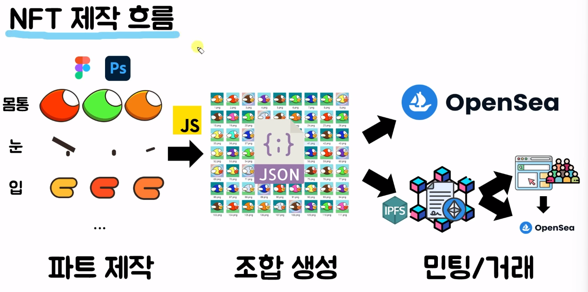
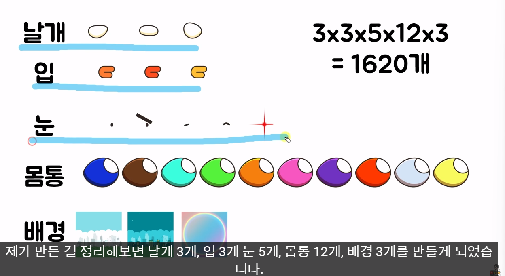
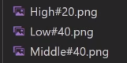
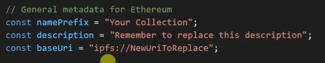

# Generative Art

## NFT란?

- FT : Fungible Token
  - 대체 가능한 토큰
  - 비트코인
- NFT : Non-Fungible Token
  - 대체 불가능한 토큰
  - 다른 사람의 NFT와 내 NFT는 대체가 불가능함
  - 서로 전혀 다른 고유한 값을 가지고 있음
  - 각각 고유한 값을 지닌 토큰
  - NFT가 누구 것인지 블록체인 위에 스마트 컨트랙트로 기록됨
  - 위변조가 불가능하며 누구나 볼 수 있음
  - [klaytnscope](https://scope.klaytn.com/)
    - 측정 NFT를 누가 누구에게 어떤 것을 줬는지 볼 수 있음
    - 어떤 지갑 주소가 몇 개의 NFT를 들고 있고 몇%를 들고 있는지 볼 수 있음

## 왜 사지?

- 예술 작품
- 트레이딩 - 시세 차익을 위해
- PFP - 내 프로필에 NFT 사진 자랑하기
- 특정 NFT를 보유한 사람만 들어올 수 있는 커뮤니티에 들어가기 위해
- 게임 아이템을 NFT화 해서 게임하면서 돈벌기

## Jolappy Bird NFT 컬랙션 만들기

## NFT 제작 흐름

- 민팅 : NFT를 처음으로 발행하는 것
  - 민팅하는 방법 2가지
    - OpenSea와 같은 NFT 거래 플랫폼을 활용
      - NFT를 등록하는 기능을 제공하고 있음
      - 내 NFT가 OpenSea에서 만든 스마트 컨트랙트에 종속되어버린다는 단점이 있음
      - 그로 인해 이 NFT에 다른 기능을 추가할 수 없이 종속되어버림
    - 직접 스마트 컨트랙트를 블록체인에 등록해서 그 블록체인에 내가 만든 이미지를 NFT로 민팅
      - 스마트 컨트랙에 내가 원하는 기능을 NFT에 추가로 넣을 수 있음
      - 내 웹사이트에서 많은 사람들이 NFT를 직접 민팅하도록 만들 수 있음
      - 이렇게 민팅한 나의 NFT를 사간 사람들이 다른 사이트에서 거래할 수 있음

## 파트 제작하기

- 이미지 사이즈 : 자유롭게 설정 가능
- 레이어로 제작해야 함
- 투명한 png로 제작하기
- 각각 파일들 (색, 디자인 모두) 다 따로 저장해줘야함

​							

이런 식..

- 확률을 조정해서 어떠한 요소가 희귀하게 나오게 할 수 있음
  - 1000개만 만든다고 한다.

## 이미지 조합

## hashlips_art_engine

[hashlips_art_engine](https://github.com/HashLips/hashlips_art_engine)

이미지 조합을 위해 사용되는 오픈소스 프로젝트이다.

### 수정해야 할 파일

`src/config.js` // `layerConfigurations`

어떤 순서로 레이어를 쌓을 것인지, 어떤 레이어들이 있는지 조절할 수 있음

#뒤에 있는 숫자를 조정함으로써 확률을 조정할 수 있다.

`src/config.js` 

이 정보를 변경해서 설정할 수 있다.

이미지를 생성한 이후라면, `npm run update_info`를 실행해 주면 된다.

### 완성본

이미지 자체 생성에는 오래 걸리지 않는다.

`build/images`에서 이미지를 확인할 수 있고, `build/json`에서 각각 이미지에 대한 메타데이터 정보 파일을 확인할 수 있다.

> 강의에서는 OpenSea에 이미지를 민팅하는 방식을 사용했다.
>
> 우리 사이트에서 직접 NFT를 민팅할 수 있는 기능이 필요하고,
>
> 이더리움 환경에 올리기 위해서는 수수료가 필요하다.
>
> 또는 OpenSea에서 이미지를 올리고 내 계좌에 집어넣는 방법도 가능하다.
>
> 다만 수수료가 어느 정도인지 알아볼 필요가 있겠다.
