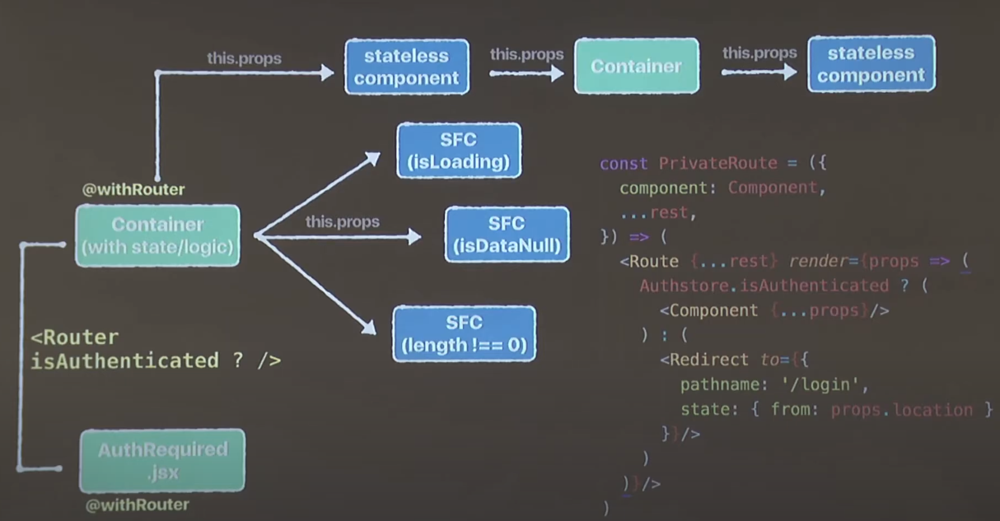
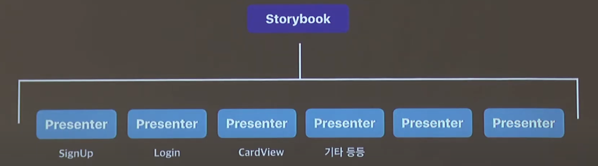
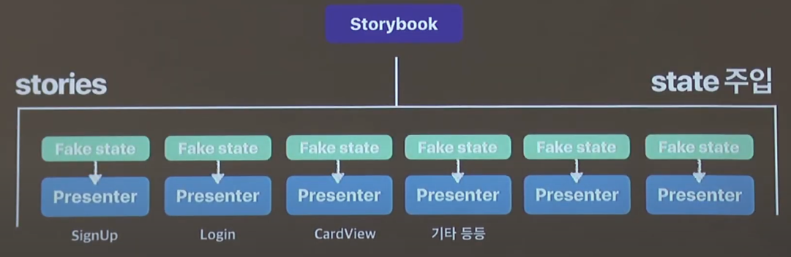
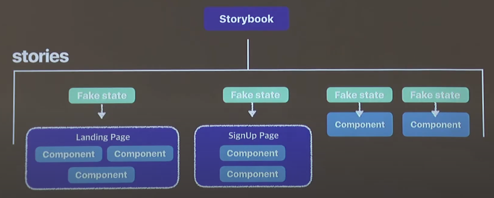
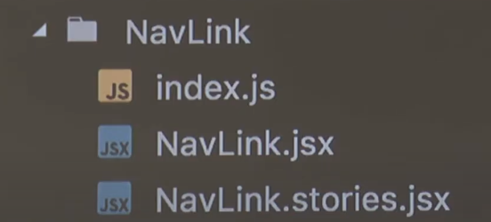

# Storybook

0809 TIL

## 개요

스토리북(Storybook)은 한 단어로, UI 컴포넌트 개발 도구이다.

단순히 UI 라이브러리를 문서화하기 위한 목적으로 사용할 수도 있고,

외부 공개용 디자인 시스템을 개발하기 위한 기본 플랫폼으로도 사용할 수 있다.

스토리북의 기본 구성 단위는 스토리(Story)이다.

하나의 UI 컴포넌트는 보통 하나 이상의 Story를 가지게 된다.

각 Story는 해당 UI 컴포넌트가 어떻게 사용되는지 보여주는 예시가 된다.

Storybook을 사용하면 UI 컴포넌트가 각각 독립적으로 어떻게 랜더링되는지 직접 보면서 테스트할 수 있다.

코드를 보지 않고도 미리 UI 컴포넌트를 사용해볼 수 있다는 점에서 매우 편리하다.

## 왜 스토리북인가?

개발하다보면 정말 많은 컴포넌트들을 마주하게 되고, 그것을 관리하게 된다.

때로는 '어떠한 상태'에만 보이는 컴포넌트들을 만들게 되는데, (ex) Login 했을 때만 보이는 페이지)

각각의 상태를 모두 다 만들어 놓고 테스트하기 어려운 경우들이 발생한다.

>  로그인/비로그인/데이터 있음/데이터 없음/로딩중/라우터 ... 여러 상황에 따라 달라지는 컴포넌트들

이러한 상황에서 스토리북은 복잡한 Presenter 컴포넌트들을 선형적으로 나열한다.

따라서, 우리는 보고 싶은 컴포넌트를 원하는 상황에서 볼 수 있게 된다.

이 컴포넌트들은 state에 의존적이므로, Storybook은 목업 state를 넣어주고 처리할 수 있게 한다.

또한 컴포넌트들을 페이지별로 묶어서 스토리로 보여주도록 할 수 있다.

하나의 스토리는 하나의 페이지가 되고, 그 안에 여러 컴포넌트들이 들어가게 하는 것이다.

이 외에도 Flow 단위로 스토리를 만들 수도 있다. (ex) Sign up Flow)

>  정리하자면, 
>
> 스토리북은 각종 routing과 state들로 연결되어있는 리액트 view 컴포넌트들을 normalize시켜
>
> 독립된 환경에서 돌아가게 해주는 간단한 scaffolder이자 UI 테스팅 툴이다.

### Keyword

- Normalize
- Modularization
- Isolated

### 핵심

1. Component를 isolated된 환경에서 개발
2. webpack과 addon을 통해 storybook과 Interactive한 개발
3. 컴포넌트 별 라이브러리화 해서 브라우징 가능
4. 깔끔한/모듈화된 view의 강제성 - Clean 코드와 재사용성 증가
5. 쉽고 빠른 deploy와 협업

## Story

공식문서에서는 'element들을 나타나게 하는 함수' 라고 말하고 있지만,

개발자에 따라서 자율적으로 정의할 수 있다.

[참고영상(09:41 ~)](https://youtu.be/jc9xKzdkYDg)

State 값을 변경하면 동적으로 웹페이지가 변하는 모습을 볼 수 있고,

웹팩을 이용해 코드를 바꾸면서 변하는 모습을 바로 볼 수도 있다.

## Setup

Storybook에는 CLI가 있어서 간편하게 설정할 수 있다.

`create react app`이 되어 있는 상태에서,

1. 프로젝트로 이동

   `cd my-project-directory`

2. 스토리북 설치

​	`yarn add global @storybook/cli`

​	`getstorybook`

## 사용법

스토리북을 사용하기 위해서는 스토리북에 들어가는 컴포넌트를 따로 작성해 주어야 한다.

처음에 `src` 디렉토리를 만든 다음 `stories` 디렉토리를 만들어 준 후 그곳에서 `story`를 불러와 준다.

`stories/WhateverStory.js`

`storybook/config.js` 파일이 존재하지만 `cli`를 쓰기 때문에 맨 처음에는 따로 만져줄 필요가 없다.

story 수가 많아지는 경우에는 story를 컴포넌트와 함께 관리하는 것이 좋다.

이렇게 각 컴포넌트마다 스토리를 따로 만들어주면(`SomeComponent.stories.jsx`),

스토리북이 동적으로 샘플링하는 기능이 존재한다.

## AddOn

스토리북의 플러그인 요소

각각의 애드온들을 공식 문서를 참고하여 설치할 수 있다.

큰 틀로는 `addon.js`를 추가한 다음 스토리북 파일에서 사용하면 된다.

### Knobs

Knobs 애드온은 컴포넌트의 props를 스토리북 화면에서 바꿔서 바로 반영시켜줄 수 있는 애드온이다.

[Knobs 문서](https://github.com/storybookjs/storybook/tree/master/addons/knobs) 

**사용할 수 있는 Knobs 종류**

- text: 텍스트를 입력 할 수 있다.
- boolean: true/false 값을 체크박스로 설정 할 수 있다.
- number: 숫자를 입력 할 수 있습니다. 1~10과 같이 간격을 설정 할 수도 있다.
- color: 컬러 팔레트를 통해 색상을 설정 할 수 있다.
- object: JSON 형태로 객체 또는 배열을 설정 할 수 있다.
- array: 쉼표로 구분된 텍스트 형태로 배열을 설정 할 수 있다.
- select: 셀렉트 박스를 통하여 여러가지 옵션 중에 하나를 선택 할 수 있다.
- radios: Radio 버튼을 통하여 여러가지 옵션 중에 하나를 선택 할 수 있다.
- options: 여러가지 옵션을 선택 하는 UI 를 커스터마이징 할 수 있다 (radio, inline-radio, check, inline-check, select, multi-select)
- files: 파일을 선택 할 수 있다.
- date: 날짜를 선택 할 수 있다.
- button: 특정 함수를 실행하게 하는 버튼을 만들 수 있다.

### Actions

Actions 애드온은 컴포넌트를 통하여 특정 함수가 호출됐을 때 어떤 함수가 호출됐는지, 함수에 어떤 파라미터를 넣어서 호출했는지에 대한 정보를 확인할 수 있게 한다.

간단한 함수 호출부터 리액트 라우터의 주소가 변경될 때를 확인하거나 리덕스 스토어의 `dispatch`를 mocking하여 디스패치 되는 액션의 정보를 볼 수도 있다.

CLI에 기본적으로 적용되어 있기 때문에 별도로 설치하지 않아도 된다.

[Actions 문서](https://github.com/storybookjs/storybook/tree/main/addons/actions)

[체험해 보기](https://react.carbondesignsystem.com/?path=/story/checkbox--checked)

### Docs

Docs 애드온은 MDX 형식으로 문서를 작성할 수 있게 하고, 컴포넌트의 props와 주석에 기반하여 자동으로 문서를 생성해준다.

[Docs 문서](https://github.com/storybookjs/storybook/tree/main/addons/docs)

### Links

유저 플로우와 같은 링크로 이루어지는 스토리를 만들 때 사용한다.

[Links 문서](https://storybook.js.org/addons/@storybook/addon-links)

### console

스토리북에 콘솔이 보이게 한다.

[console 문서](https://storybook.js.org/addons/@storybook/addon-console)

## Storybook Driven Development

~~반드시 따라야 하는 건 아니에요.~~

### 1. Define Behavior flow/possible states

유저의 행동을 정의하고 화면별로 나올 수 있는 경우의 수를 모두 계산하고 디자인한다.

프로젝트 기획/설계 단계에서 검토해야 하는 부분이다.

### 2. Stories first

앱을 설계하기 전에 **무조건** 스토리를 먼저 정의하고 만든다.

스토리를 먼저 만들게 되면, 프로젝트 진행 속도가 느리게 느껴지게 된다.

이를 위해 [**Atomic Design**](https://fe-developers.kakaoent.com/2022/220505-how-page-part-use-atomic-design-system/)을 도입하는 것을 추천한다.

### 3. Embody atoms, pages, flows in stories

스토리별로 필요한 페이지, 유저 플로우 등을 정의한다.

즉, 1단계를 스토리북을 통해서 검증한다.

이 때, 완벽히 똑같을 수는 없기 때문에 지속적으로 수정해준다.

### 4. Happy Coding! + Continuous storybook

이제 코딩을 하면 됩니다. 그리고 스토리북으로 관리하면 됩니다.

## 참고링크

[NaverD2 - Say Hello to Storybook](https://youtu.be/jc9xKzdkYDg)

[velopert.log - Storybook을 다양한 Addon과 함께 활용해보면서 사용법 정복하기](https://velog.io/@velopert/start-storybook)

