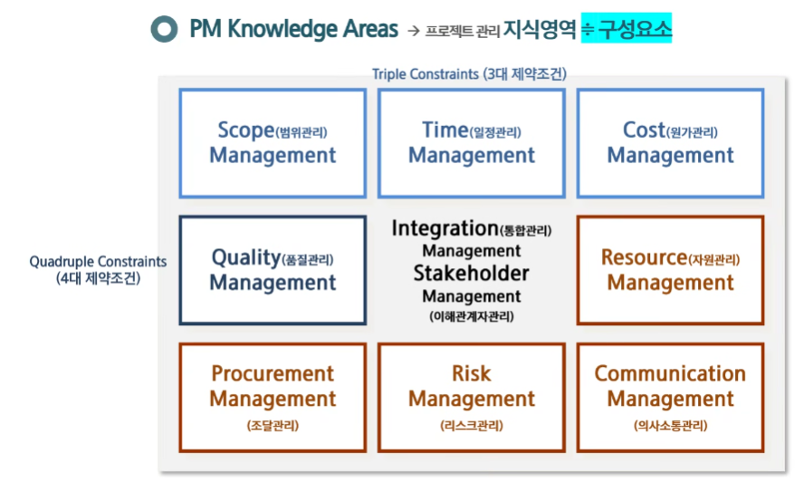
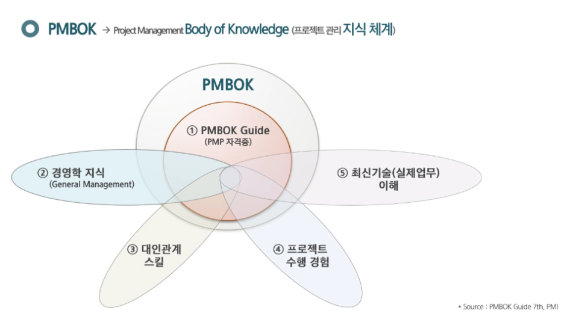
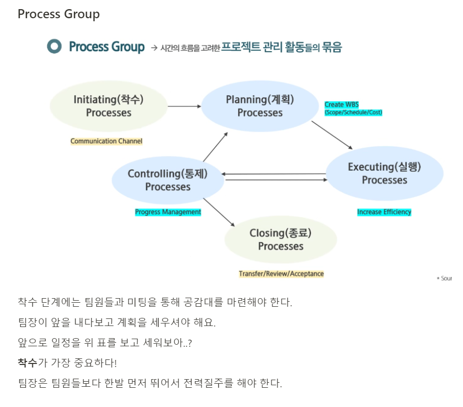

# PM 특강

## 팀장이 해야 할 일 - 산소와 같은 역할

### 커뮤니케이션

- 모든 팀원들과 커뮤니케이션을 1:1로 할 수 있어야 한다.
- 팀의 `허브` 와 같은 역할을 할 수 있어야 한다.

### 리더쉽

- 수평적인 조직의 팀장은 의견을 묻고 잘 경청한다.
- 멱살잡고 끌고 가는건 위기 상황에서만.

### Project Management - 오늘 특강 내용

- 업무의 맥을 짚어서
  - 일정 계획
  - 예산 타냄
  - 업무 분배 및 재분배
  - 품질 확인

## 프로젝트(Project) 정의

- 한시적 수행기간
  - 6주동안 어떻게 할 건지 톱니바퀴처럼 정해 놓아야 한다.
- 유니크한 산출물
  - 한시적인 시간 안에 유니크한 산출물을 만들어내야 함
- 프로젝트의 반댓말 : 오퍼레이션
  - 반복적이고 유니크하지 않은 것

팀장은 결과물을 어떻게 만들어낼지 고민해야 하고, 팀원들은 본인이 맡은 일을 제때 해내면 된다.

팀원들이 PM을 모르더라도 프로젝트가 매끄럽게 흘러가도록 해야 한다.

## PM Overview

- 범위관리 : 해야할 일
  - 6주동안 해야할 일이 지금 결정이 되어 있나요?
  - 해야 할 일을 여러개 쪼개고, 그걸로 목록을 만들어야 한다.
  - 목록을 만들고 각각의 역할을 정의해야 해요.
  - 그 다음에 일정을 계획해야 해요.

왼쪽에서 오른쪽 단계로 진행

100~200만원 선으로 싸피에서 살 수 있다. 서류작업을 통해서..

미리미리 서류작업을 하자.

팀원이라는 자원을 잘 다루어야 한다. 자원관리는 갈등관리를 포함하고 있다.

작업했던 소스코드가 싹 날아갔다.. 그런걸 미리 확인 및 대비해야 합니다.

다른 소스를 사용할 수 있다고 하면 최대한 찾아보고 과감하게 사용해야 한다.

- 통합관리 : 팀장의 의사결정 - 필요할때 의사결정 해야함
- 이해관계자관리 : 주변 멘토님, 다른 많은 사람들의 도움을 받도록 해야함

가장 중요한 건 **통합관리**

팀원들과 민주적으로 의견을 나누어서 의사를 결정하는게 가장 중요하다!

3, 4번은 교육으로 배울 수 없다. 경험해야만 가능하다…

**대인관계 스킬**이 가장 중요하다.

팀원들과의 1:1 관계, 상당히 중요하다!

