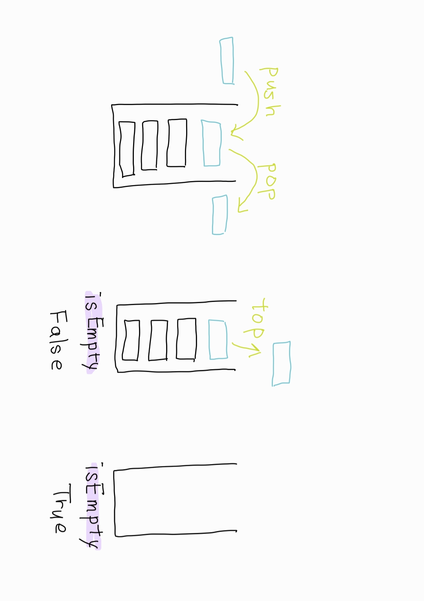

# 스택

2022.02.14

참고자료

- [위키백과 - 스택](https://ko.wikipedia.org/wiki/%EC%8A%A4%ED%83%9D)
- [파이썬으로 구현하는 자료구조! - 스택(stack)](https://somjang.tistory.com/entry/%ED%8C%8C%EC%9D%B4%EC%8D%AC%EC%9C%BC%EB%A1%9C-%EA%B5%AC%ED%98%84%ED%95%98%EB%8A%94-%EC%9E%90%EB%A3%8C%EA%B5%AC%EC%A1%B0-%EC%8A%A4%ED%83%9D-Stack)


## 1단계 : 자료구조의 목적과 이론 이해

- 스택

  - 스택(stack)은 제한적으로 접근할 수 있는 나열 구조이다. 접근 방법은 언제나 목록의 끝에서만 일어난다.

  - 스택은 한 쪽 끝에서만 자료를 넣거나 뺄 수 있는 선형 구조(LIFO - Last In First Out)으로 되어 있다. 자료를 넣는 것을 '밀어넣는다' 하여 푸쉬(push)라고 하고 반대로 넣어둔 자료를 꺼내는 것을 팝(pop)이라고 하는데, 이 때 꺼내어지는 자료는 가장 최근에 푸쉬한 자료부터 나오게 된다. 이처럼 나중에 넣은 값이 먼저 나오는 것을 LIFO(후입선출) 구조라고 한다.

  - 프링글스 과자통, 팬케이크 쌓기 등으로 이해해 볼 수 있다.

    

    

    - Method
      - push : 데이터를 삽입하는 과정
      - pop : 가장 마지막에 삽입한 데이터를 삭제하는 과정, 스택에 데이터가 비어있는지 여부를 먼저 확인한 후에 실행한다.
      - top : 가장 마지막에 삽입한 데이터를 삭제하지 않고 return 해주는 메소드
      - isEmpty : 현재 스택이 비어있는지 여부를 확인하는 메소드


## 2단계 : 자료구조의 구현 로직 따라가기

- Python List로 스택 구현하기

  ```python
  class Stack():
      def __init__(self):
          self.stack = []
          
      def push(self, data):
          self.stack.append(data)
          
      def pop(self):
          pop_object = None
          if self.isEmpty():
              print("Stack is Empty")
          else:
              pop_object = self.stack.pop()
              
          return pop_object   
  
      def top(self):
          top_object = None
          if self.isEmpty():
              print("Stack is Empty")
          else:
              top_object = self.stack[-1]
              
          return top_object
      
      def isEmpty(self):
          is_empty = False
          if len(self.stack) == 0:
              is_empty = True
          return  is_empty
  ```

  

- Python Singly Linked List로 스택 구현하기

  ```python
  class Node:
      def __init__(self, data):
          self.data = data
          self.next = None
  
  class LinkedListStack():
      def __init__(self):
          self.head = None
  
      def push(self, data):
          new_node = Node(data)
          new_node.next = self.head
          self.head = new_node
  
      def pop(self):
          pop_object = None
          if self.isEmpty():
              print("Stack is Empty")
          else:
              pop_object = self.head.data
              self.head = self.head.next
  
          return pop_object
  
      def top(self):
          top_object = None
          if self.isEmpty():
              print("Stack is Empty")
          else:
              top_object = self.head.data
  
          return top_object
  
      def isEmpty(self):
          is_empty = False
          if self.head is None:
              is_empty = True
          return  is_empty
  ```

  


## 3단계 : 자료구조의 형태와 오퍼레이션 직접 구현하기

