# List 1 - Array 1

2022.02.14

APS(Algorithm Problem Solving) 과정을 통해 자료구조와 알고리즘을 학습하면서 다양한 형태의 정렬을 학습하게 된다.


## 배열(Array)

- 배열

  - 일정한 자료형의 변수들을 하나의 이름으로 열거하여 사용하는 자료구조

    예시) 6개의 변수를 배열로 바꾸어 사용하는 모습

    


- 배열의 필요성
  - 프로그램 내에서 여러 개의 변수가 필요할 때, 일일이 다른 변수명을 이용하여 자료에 접근하는 것은 매우 비효율적일 수 있다.
  - 배열을 이용하면 하나의 선언을 통해서 둘 이상의 변수를 선언할 수 있다.
  - 단순히 다수의 변수 선언을 의미하는 것이 아니라, 다수의 변수로는 하기 힘든 작업을 배열을 활용해 쉽게 할 수 있다.


- 1차원 배열

  - 1차원 배열의 선언

    - 별도의 선언 방법이 없으면 변수에 처음 값을 할당할 때 생성

    - 이름 : 프로그램에서 사용할 배열의 이름

      예시) 1차원 배열 선언

      ```python
      Arr = list()
      Arr = []
      Arr = [1, 2, 3]
      Arr = [0]*10
      ```

  - 1차원 배열의 접근

    - `Arr[0] = 10;` // '배열 Arr의 0번 원소에 10을 저장하라'
    - `Arr[idx] = 20;` // '배열 Arr의 idx번 원소에 20을 저장하라'


## 정렬(Sort)

- 정렬
  - 2개 이상의 자료를 특정 기준에 의해 작은 값부터 큰 값(오름차순 : ascending), 혹은 그 반대의 순서대로(내림차순 : descending) 재배열하는 것


- 키(Key)
  - 자료를 정렬하는 기준이 되는 특정 값


- 대표적인 정렬 방식의 종류
  - 버블 정렬 (Bubble Sort)
  - 카운팅 정렬 (Counting Sort)
  - 선택 정렬 (Selection Sort)
  - 퀵 정렬 (Quick Sort)
  - 삽입 정렬 (Insertion Sort)
  - 병합 정렬 (Merge Sort)


- 정렬 방식의 종류별 특성

  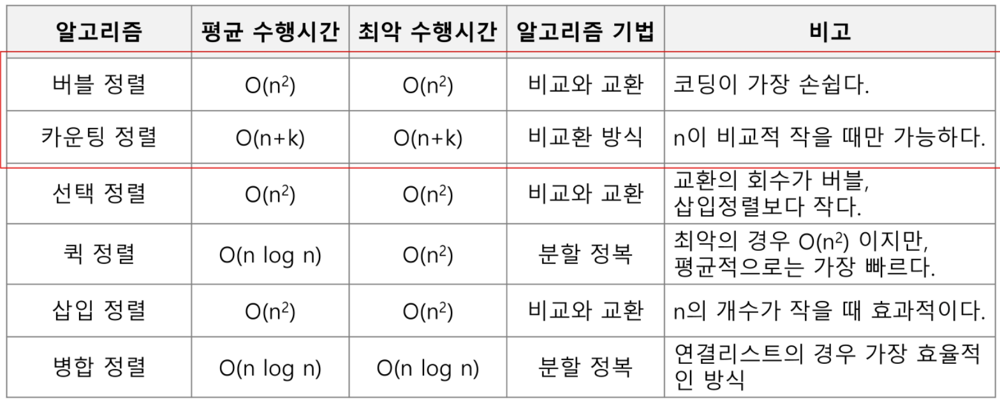


## 버블 정렬(Bubble Sort)

- 버블 정렬
  - 인접한 두 개의 원소를 비교하며 자리를 계속 교환하는 방식


- 정렬 과정
  - 첫 번째 원소부터 인접한 원소끼리 계속 자리를 교환하면서 맨 마지막 자리까지 이동한다.
  - 한 단계가 끝나면 가장 큰 원소가 마지막 자리로 정렬된다.
  - 교환하며 자리를 이동하는 모습이 물 위에 올라오는 거품 모양과 같다고 하여 버블 정렬이라고 한다.


- 시간 복잡도
  - O(n^2)


- 수도 코드

  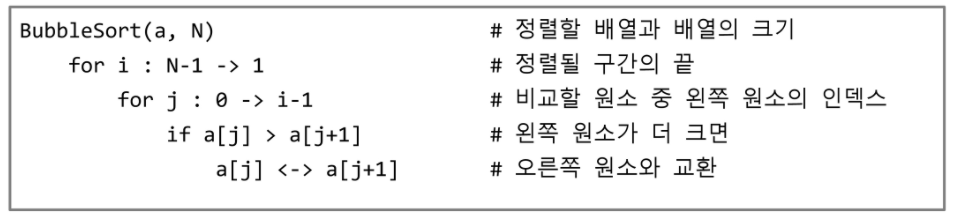


- 코드 구현

  ```python
  def BubbleSort(a, N) : # 정렬할 List, N 원소 수
      for i in range(N-1, 0, -1): # 범위의 끝 위치
          for j in range(0, i): 
              if a[j] > a[j+1]:
                  a[j], a[j+1] = a[j+1], a[j]
  ```

  


## 카운팅 정렬(Counting Sort)

- 카운팅 정렬

  - 항목들의 순서를 결정하기 위해 집합에 각 항목이 몇 개씩 있는지 세는 작업을 하여, 선형 시간에 정렬하는 효율적인 알고리즘

    > 선형 시간이란? 
    >
    > 계산 복잡도 이론에서, 입력의 길이 n에 대하여, 어떤 알고리즘의 실행시간이 선형(O(n))이 되는 것을 뜻한다.


- 제한 사항
  - 정수나 정수로 표현할 수 있는 자료에 대해서만 적용 가능 : 각 항목의 발생 회수를 기록하기 위해, 정수 항목으로 인덱스 되는 카운트들의 배열을 사용하기 때문이다.
  - 카운트들을 위한 충분한 공간을 할당하려면 집합 내의 가장 큰 정수를 알아야 한다.


- 시간 복잡도
  - O(n+k) : n은 리스트 길이, k는 정수의 최대값


- 카운팅 정렬의 예시

  - [0, 4, 1, 3, 1, 2, 4, 1] 을 카운팅 정렬하는 과정

    - 1단계

      - Data에서 각 항목들의 발생 회수를 세고, 정수 항목들로 직접 인덱스 되는 카운트 배열 counts에 저장한다.

        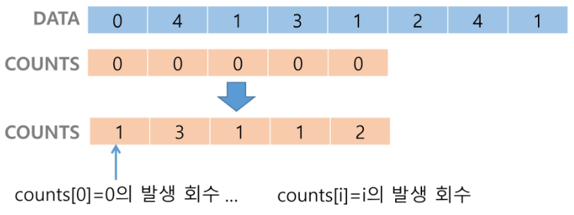

    - 2단계

      - 정렬된 집합에서 각 항목의 앞에 위치할 항목의 개수를 반영하기 위해 counts의 원소를 조정한다.

        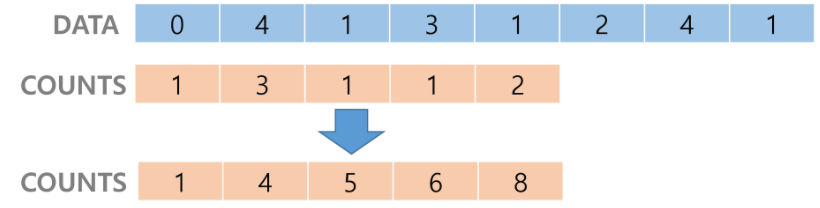

    - 3단계

      - 각각의 counts를 감소시키고 Temp에 업데이트한다.

        - counts[1]을 감소시키고 Temp에 1을 삽입한다.

          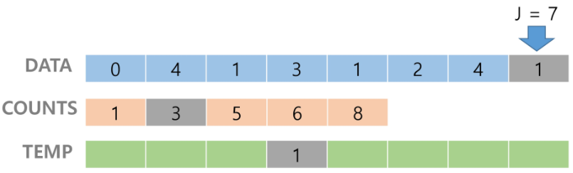

        - counts[4]를 감소시키고 temp에 4를 삽입한다.

          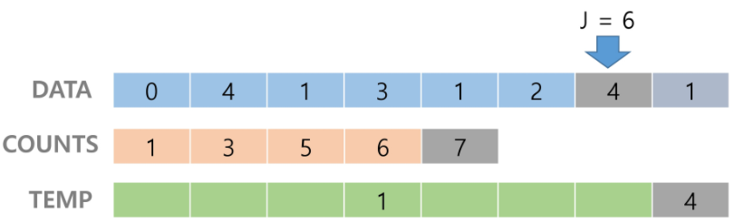

        - counts[2]를 감소시키고 temp에 2를 삽입한다.

          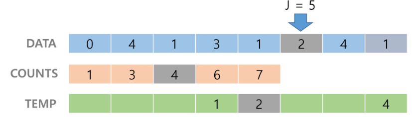

        - counts[1]을 감소시키고 temp에 1을 삽입한다.

          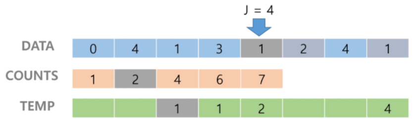

        - counts[3]을 감소시키고 temp에 3을 삽입한다.

          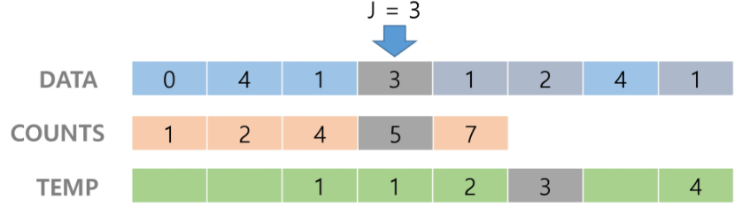

        - counts[1]을 감소시키고 temp에 1을 삽입한다.

          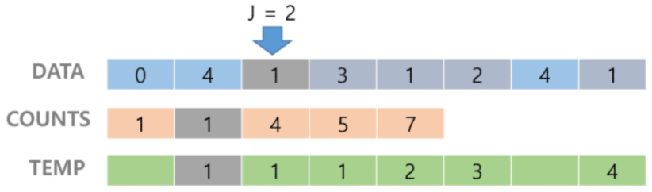

        - counts[4]을 감소시키고 temp에 4을 삽입한다.

          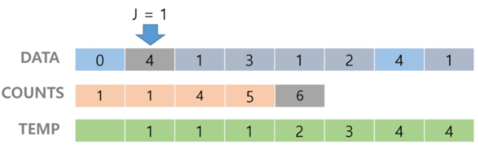

        - counts[0]을 감소시키고 temp에 0을 삽입한다.

          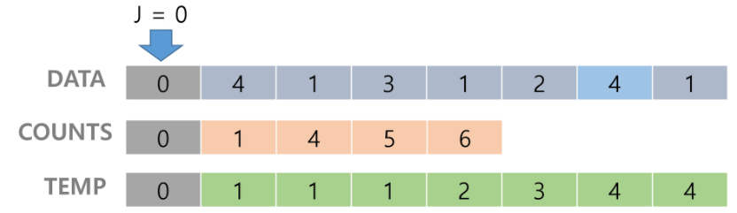

    - 4단계 : Temp 업데이트를 완료하고 정렬 작업을 종료한다.


- 수도 코드

  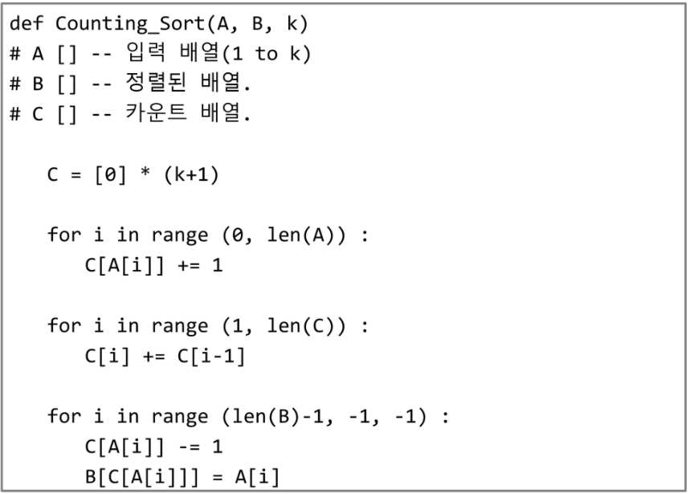


## 완전검색

- 완전 검색
  - 문제의 해법으로 생각할 수 있는 모든 경우의 수를 나열해보고 확인하는 기법.
  - Brute-force 혹은 generate-and-test 기법이라고도 불린다.
  - 모든 경우의 수를 테스트한 후, 최종 해법을 도출한다.
  - 일반적으로 경우의 수가 상대적으로 작을 때 유용하다.
  - 모든 경우의 수를 생성하고 테스트하기 때문에 수행 속도는 느리지만, 해답을 찾아내지 못할 확률이 작다.
  - 자격검정평가 등에서 주어진 문제를 풀 때, 우선 완전 검색으로 접근하여 해답을 도출한 후 성능 개선을 위해 다른 알고리즘을 사용하고 해답을 확인하는 것이 바람직하다.


## 순열

- 순열
  - 서로 다른 것들 중 몇 개를 뽑아서 한 줄로 나열하는 것
  - 서로 다를 n개 중 r개를 택하는 순열
    - nPr
    - nPr = n * (n-1) * (n-2)* ... * (n-r+1)
  - nPn
    - n! (Factorial)
    - n! +  n * (n-1) * (n-2)* ... * 2 * 1


- 순열 생성 

  예시) {1, 2, 3}을 포함하는 모든 순열을 생성하는 함수

  ​	동일한 숫자가 포함되지 않았을 때, 각 자리 수 별로 loop를 이용해 아래와 같이 구현할 수 있다.

  ```python
  for i1 in range(1, 4):
      for i2 in range(1, 4):
          if i2 != i1:
              for i3 in range(1, 4):
                  if i3 != i1 and i3 != i2:
                      print(i1, i2, i3)
  ```

  ```python
  # 출력 결과
  1 2 3
  1 3 2
  2 1 3
  2 3 1
  3 1 2
  3 2 1
  ```

  


## 그리디(Greedy Algorithm)

- 탐욕(Greedy) 알고리즘
  - 탐욕 알고리즘은 최적해를 구하는 데 사용되는 근시안적인 방법이다.
  - 여러 경우 중 하나를 결정해야 할 때마다 그 순간에 최적이라고 생각되는 것을 선택해 나가는 방식으로 진행하여 최종적인 해답에 도달한다.
  - 각 선택의 시점에서 이루어지는 결정은 지역적으로는 최적이지만, 그 선택들을 계속 수집하여 최종적인 해답을 만들었다고 하여, 그것이 최적이라는 보장은 없다.
  - 일반적으로, 머릿속에 떠오르는 생각을 검증 없이 바로 구현하면 Greedy 접근이 된다.


- 탐욕 알고리즘의 동작 과정
  1. 해 선택 : 현재 상태에서 부분 문제의 최적 해를 구한 뒤, 이를 부분해 집합(Solution Set)에 추가한다.
  2. 실행 가능성 검사 : 새로운 부분해 집합이 실행 가능한지를 확인한다. 곧, 문제의 제약 조건을 위반하지 않는지를 검사한다.
  3. 해 검사 : 새로운 부분해 집합이 문제의 해가 되는지를 확인한다. 아직 전체 문제의 해가 완성되지 않았다면, 1.의 해 선택부터 다시 시작한다.