# List2-Array2

2022.02.14


## 배열 : 2차원 배열

- 2차원 배열의 선언

  - 1차원 List를 묶어놓은 List

  - 2차원 이상의 다차원 List는 차원에 따라 Index를 선언

  - 2차원 List의 선언 : 세로길이(행의 개수), 가로길이(열의 개수)를 필요로 함

  - Python 에서는 데이터 초기화를 통해 변수선언과 초기화가 가능함

    예시)

    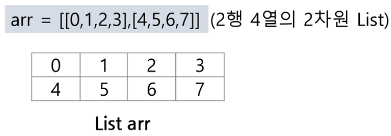

  - ```python
    N = int(input())
    arr = [list(map(int, input().split())) for _ in range(N)]
    ```

    ```python
    # 출력 결과
    3
    1 2 3
    4 5 6
    7 8 9
    ```

  - ```python
    N = int(input())
    arr = [list(map(int, input())) for _ in range(N)]
    ```

    ```python
    # 출력 결과
    3
    123
    456
    789
    ```

    

- 배열 순회
  - n X m 배열의 n * m 개의 모든 원소를 빠짐없이 조사하는 방법


- 행 우선 순회

  ```python
  # i 행의 좌표
  # j 열의 좌표
  for i in range(n):
      for j in range(m):
          Array[i][j] # 필요한 연산 수행
  ```

  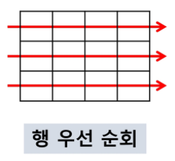


- 열 우선 순회

  ```python
  # i 행의 좌표
  # j 열의 좌표
  for j in range(m):
      for i in range(n):
          Array[i][j] # 필요한 연산 수행
  ```

  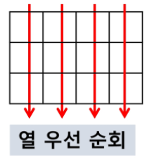


- 지그재그 순회

  ```python
  # i 행의 좌표
  # j 열의 좌표
  for j in range(n):
      for i in range(m):
          Array[i][j + (m-1-2*j)*(i%2)] # 필요한 연산 수행
  ```

  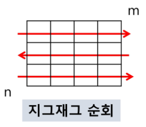


- 델타를 이용한 2차 배열 탐색

  - 2차 배열의 한 좌표에서 4방향의 인접 배열 요소를 탐색하는 방법

  - 수도코드

    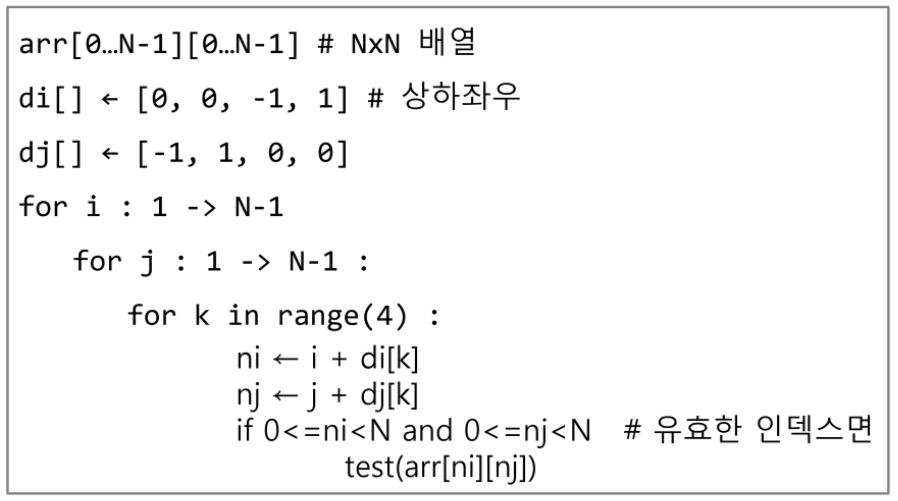


- 전치 행렬

  - 코드

    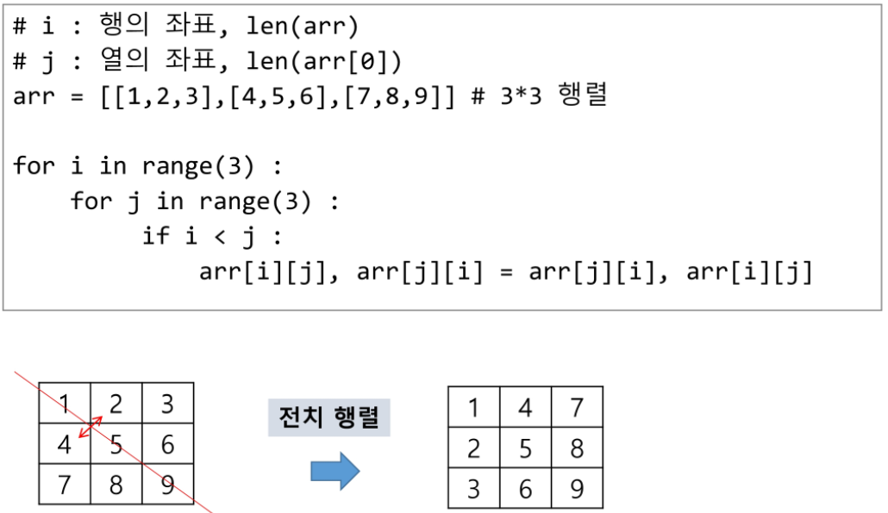


## 부분집합 생성

- 부분집합 생성하기
  - 완전검색 기법으로 부분집합 관련 문제를 풀기 위해서는, 우선 집합의 모든 부분집합을 생성한 후에 각 부분집합의 합을 계산해야 한다.


- 부분집합의 수
  - 집합의 원소가 n개일 때, 공집합을 포함한 부분집합의 수는 2^n개이다.
  - 이는 각 원소를 부분집합에 포함시키거나 포함시키지 않은 2가지 경우를 모든 원소에 적용한 경우의 수와 같다.


- 각 원소가 부분집합에 포함되었는지를 loop를 이용하여 확인하고, 부분집합을 생성하는 방법

  ```python
  bit = [0, 0, 0, 0]
  for i in range(2):
      bit[0] = i						# 0번째 원소
      for j in range(2):
          bit[1] = j
          for k in range(2):
              bit[2] = k
              for l in range(2):
                  bit[3] = 1
                  print_subset(bit)
  ```

  

- 비트 연산자

  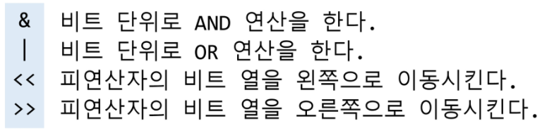

  - << 연산자

    - 1<<n : 2^n 즉, 원소가 n개일 경우의 모든 부분집합의 수를 의미한다.

  - & 연산자

    - i & (1<<j) : i의 j번째 비트가 1인지 아닌지를 검사한다.

    

  - 비트 연산자를 이용하여 부분집합을 생성하는 방법

    ```python
    arr = [3, 6, 7, 1, 5, 4]
    
    n = len(arr)		# n : 원소의 개수
    
    for i in range(1<<n):		# 1<<n : 부분 집합의 개수
        for j in range(n):		# 원소의 수만큼 비트를 비교함
            if i & (1<<j): 		# i의 j번 비트가 1인 경우
                print(arr[j], end=", ")		# j번 원소 출력
        print()
    print()
    ```

    

## 검색(Search)

- 검색
  - 저장되어 있는 자료 중에서 원하는 항목을 찾는 작업
  - 목적하는 탐색 키를 가진 항목을 찾는 것
    - 탐색 키(search Key) : 자료를 구별하여 인식할 수 있는 키
  - 검색의 종류
    - 순차 검색(sequential search)
    - 이진 검색(binery search)
    - 해쉬(hash)


## 순차 검색(sequential search)

- 순차 검색
  - 일렬로 되어 있는 자료를 순서대로 검색하는 방법
    - 가장 간단하고 직관적인 검색 방법
    - 배열이나 연결 리스트 등 순차구조로 구현된 자료구조에서 원하는 항목을 찾을 때 유용함
    - 알고리즘이 단순하여 구현이 쉽지만, 검색 대상의 수가 많은 경우에는 수행시간이 급격히 증가하여 비효율적
  - 2가지 경우
    - 정렬되어 있지 않은 경우
    - 정렬되어 있는 경우


- 정렬되어 있지 않은 경우

  - 검색 과정

    - 첫 번째 원소부터 순서대로 검색 대상과 키 값이 같은 원소가 있는지 비교하며 찾는다.
    - 키 값이 동일한 원소를 찾으면 그 원소의 인덱스를 반환한다.
    - 자료구조의 마지막에 이를 때까지 검색 대상을 찾지 못하면 검색 실패

  - 찾고자 하는 원소의 순서에 따라 비교회수가 결정됨.

    - 첫 번째 원소를 찾을 때는 1번 비교, 두 번째 원솔르 찾을 때는 2번 비교... (반복)

    - 정렬되지 않은 자료에서의 순차 검색의 평균 비교 회수

      - (1/n)*(1+2+3+...+n) = (n+1)/2

    - 시간 복잡도 : O(n)

      구현 예시 수도코드

      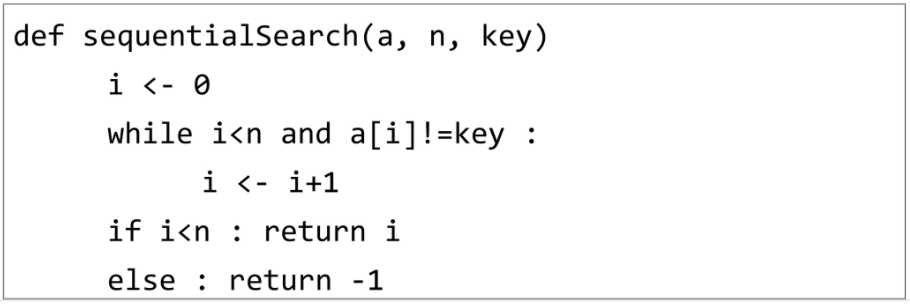


- 정렬되어 있는 경우

  - 검색 과정

    - 자료가 오름차순으로 정렬된 상태에서 검색을 실시한다고 가정하자.
    - 자료를 순차적으로 검색하면서 키 값을 비교하여, 원소의 키 값이 검색 대상의 키 값보다 크면 찾는 원소가 없다는 것이므로 더 이상 검색하지 않고 검색을 종료한다.

  - 찾고자 하는 원소의 순서에 따라 비교회수가 결정됨

    - 정렬이 되어있으므로, 검색 실패를 반환하는 경우 평균 비교 회수가 반으로 줄어든다.

    - 시간 복잡도 : O(n)

      구현 예시 수도코드

      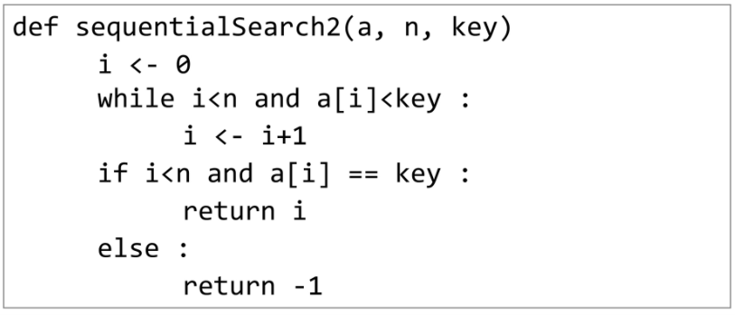


## 이진 검색 (Binary Search)


## 셀렉션 알고리즘 (Selection Algorithm)


## 선택 정렬 (Selection Sort)


---

수업 필기

10진수를 2진수로 다루는 아이가 bit 연산자이다.

```python
print(bin(10))
# 출력결과
0b1010

print(bin(10<<1))
# 출력결과
0b10100

print(bin(10<<2))
# 출력결과
0b101000
# <<1을 하면 10진수 숫자를 *2 한것과 같다.

print(bin(10>>1))
# 출력결과
0b101
```


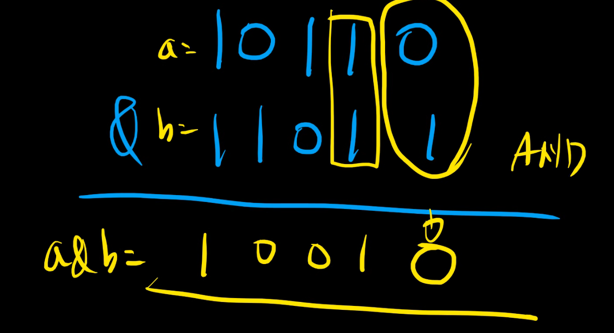

(교수님의 & 연산자 필기)

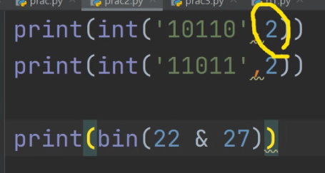

(위의 필기를 코드로 표현하면 이런 모양이 되고, 0b10010이 출력된다.)

교재의 &연산자 내용이 '이건 아니다!' 라고 하셨다. 내용에 boolen이 포함되면 맞는 말이 된다. &연산자 내용은 다르게 대체하는 게 좋겠다.

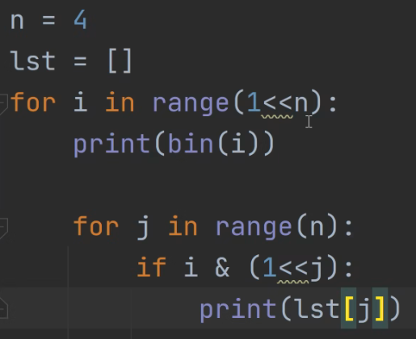

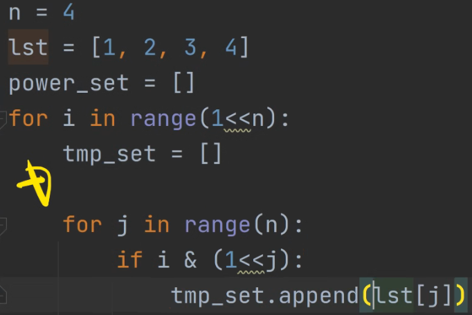

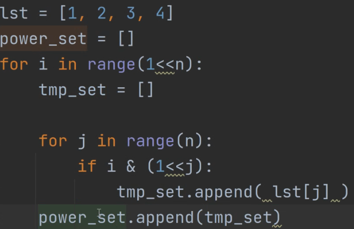

(print(power_set) 해봐)

부분집합 합 문제 구현하기 >> 공집합이 들어오는 경우를 고려해야 해.

처음에 비효율을 한번 하고, 나중에 작업할 때 안하는 게 더 좋아. 작업할 때 비효율은 작업 수가 늘어날수록 늘어나니까.


이진 검색 알고리즘 : 책 뜯어버리는 전화번호 찾기, 업다운 술게임

