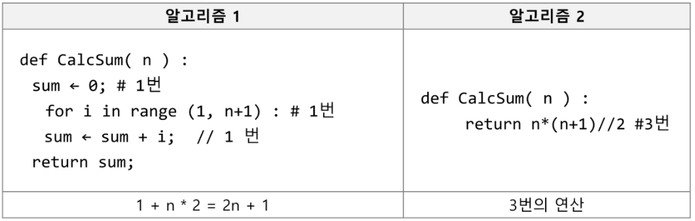
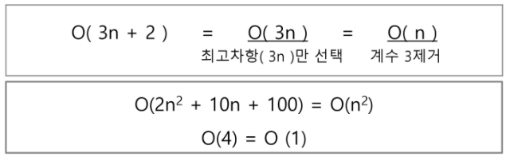
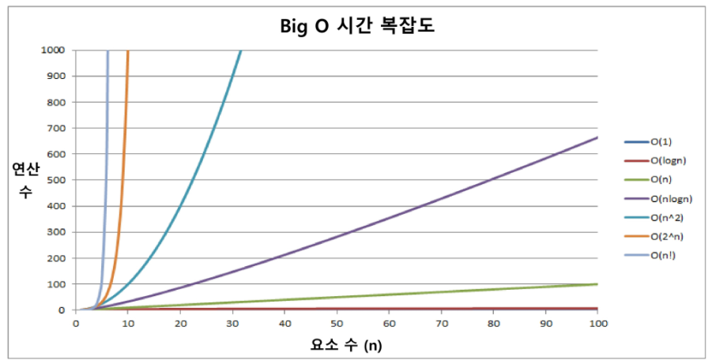

# algorithm

2022.01.14

APS(Algorithm Problem Solving) 과정

목표 : 보다 좋은 알고리즘을 이해하고 활용하는 것

## 알고리즘

- 알고리즘
  - 유한한 단계를 통해 문제를 해결하기 위한 절차나 방법이다. 주로 컴퓨터용어로 쓰이며, 컴퓨터가 어떤 일을 수행하기 위한 단계적 방법을 말한다.
  - 간단하게 다시 말하면 어떠한 문제를 해결하기 위한 절차라고 볼 수 있다.

- 알고리즘의 예
  - 1부터 100까지의 합을 구하는 문제를 생각해 보자.

- 알고리즘을 컴퓨터 분야에서 표현하는 방법

  - 의사코드(슈도코드, Pseudocode)

    

  - 순서도

    

- 좋은 알고리즘의 특성 5가지
  1. 정확성 : 얼마나 정확하게 동작하는가
  2. 작업량 : 얼마나 적은 연산으로 원하는 결과를 얻어내는가
  3. 메모리 사용량 : 얼마나 적은 메모리를 사용하는가
  4. 단순성 : 얼마나 단순한가
  5. 최적성 : 더 이상 개선할 여지없이 최적화되었는가

- 알고리즘의 성능 측정하기

  - 알고리즘의 작업량은 성능 분석의 기준이 된다.

    

    이 경우에 알고리즘2가 작업량이 적으므로 알고리즘의 성능이 더 높다고 할 수 있다.

  - 시간 복잡도(Time Complexity)

    - 알고리즘의 작업량을 표현할 때 시간복잡도로 표현한다.

    - 실제 걸리는 시간을 측정

    - 실행되는 명령문의 개수를 계산

      

  - 시간 복잡도 ; 빅-오(O) 표기법(Big-Oh Notation)

    - 시간 복잡도 함수 중에서 가장 큰 영향력을 주는 'n에 대한 항'만을 표시한다.

    - 계수(Coefficient)는 생략하여 표시한다.

      예시)

      - n개의 데이터를 입력 받아 저장한 후 각 데이터에 1씩 증가시킨 후 각 데이터를 화면에 출력하는 알고리즘의 시간복잡도는? : O(n)

    - 요소 수가 증가함에 따라 각기 다른 시간복잡도의 알고리즘은 아래와 같은 연산 수를 보인다.

      