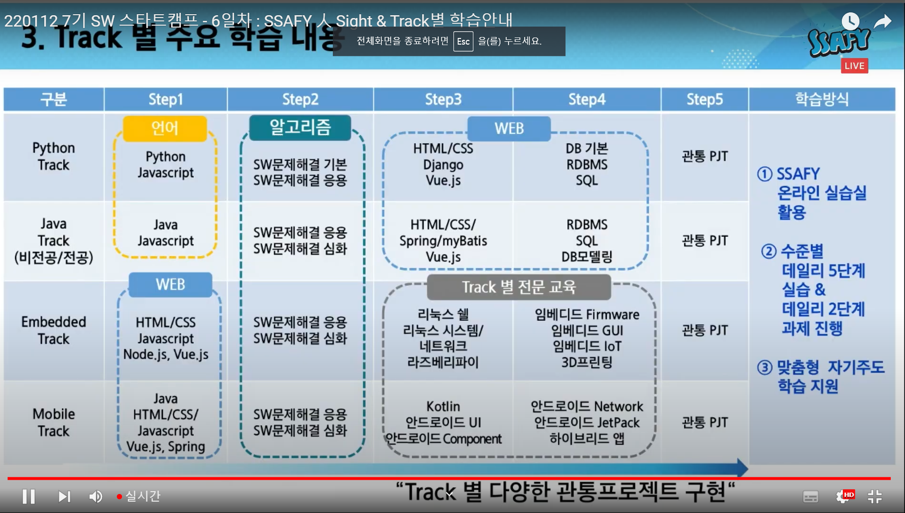

이 문서는 파일 자체를 들고 있는게 아니라 그 문서 안에 있는 이미지를 보여주는 거야.

그래서 내가 타이포라에 이미지를 넣으면 그 이미지에 해당하는 폴더가 하나 자동으로 생겨.


-16419699835761.png)


도로롱~


숑숑숑~

오 쩌는데?

그냥 그림을 끌어오면 다 저장이 되는거네???

오 쩐다


.jpg)


아 어떤건 안되네..


[타이포라 검색결과](https://tttsss77.tistory.com/149)

[보여줄 링크의 이름](링크 주소 html)


| :테이블                                                      | :테이블 | :테이블 |
| ------------------------------------------------------------ | ------- | ------- |
| 어 됐다                                                      |         |         |
| [참조한 링크](https://inasie.github.io/it%EC%9D%BC%EB%B0%98/%EB%A7%88%ED%81%AC%EB%8B%A4%EC%9A%B4-%ED%91%9C-%EB%A7%8C%EB%93%A4%EA%B8%B0/) |         |         |
| 컨트롤 엔터 누르면 아래에 또 표 만들 수 있음                 |         |         |


>
>
>인용문 만들기
>
>>
>>
>>또 만들기
>>
>>>또 만들기 이건 > 이거 누르고 엔터 누르면 생김

/> 꺽쇠를 사용해서 인용문을 사용할 수 있습니다.

---

구분선을 만들 수 있다.

/--- 을 적으면 구분선이 생긴다.

---

***

별 세개, 언더스코어 세개도 구분선이 생긴다.


___

볼드 표시 만드는 법

*볼드*

**볼드**

별 하나 단어 하나 이렇게 끼워넣으면 옆으로 눕고(이탤릭체)

별 두개 사이에 끼워넣으면 볼드가 된다.

*누워*

~취소선~

아니네

~~취소선~~

물결 두개로 둘러싸면 취소선이 됩니다.


# 제목

## 제목2

- 리스트

- 리스트

  1. 순서가 있는 리스트

  2. ```python
     print('hi')
     ```

문장 사이에 코드를 넣고 싶다면

`pirnt()`

이렇게 만들 수 있지~

