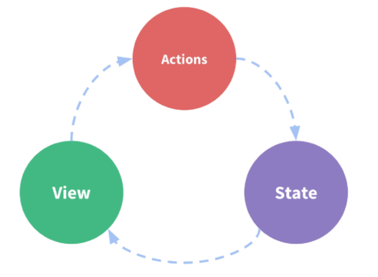

# 1. Vuex, State


```javascript
// src/store.js

import Vue from 'vue'
import Vuex from 'vuex'

Vue.use(Vuex)

const store = new Vuex.Store({
    
    // 이 부분에서 구현함
    
})

export default store
```


Vuex는 상태 관리 라이브러리.

각각의 컴포넌트에서 공통으로 필요로 하는 데이터들을 관리해주는 기능.

데이터들의 변화를 관리해서, 데이터 변화의 흐름을 쉽게 파악할 수 있다.

이를 위한 **상태 관리 패턴**을 이해해야 한다.


- 상태 관리 패턴



View : 사용자에게 보이는 화면

State : 상태들이 모여있는 저장소

Actions : 상태들을 변화시키는 행위 (update)


---


## State


- State에 데이터 저장하기

```javascript
// src/store.js

import Vue from 'vue'
import Vuex from 'vuex'

Vue.use(Vuex)

const store = new Vuex.Store({
    state: {
        	count: 0,
    }
})

export default store
```

```javascript
// src/main.js

import Vue from 'vue'
import App from './App.vue'
import store from './store.js'

Vue.config.productionTip = false

new Vue({
    render:h => h(App),
    store,
}).$mount('#app')

console.log(store.state.count);
// 데이터를 저장한 위치가 store에 있는 state 객체이기 때문에 count 값을 알기 위해 store.state.count 사용
```

이 상태에서는 개발자 도구에서만 보인다.

---

개발자 도구가 아닌 화면에서도 볼 수 있게 하려면 store 객체를 사용할 수 있어야 한다.

store객체를 사용하기 위해, Vue 인스턴스에 해당 객체를 등록한다.

```javascript
// src/main.js

import Vue from 'vue'
import App from './App.vue'
import store from './store.js'

Vue.config.productionTip = false

new Vue({
    render:h => h(App),
    store,
}).$mount('#app')
```

console.log 코드만 지운 상태이다.

이 상태에서는 store이라는 객체를 Vue 인스턴스에 설정되어 있다.

이 때, store이라는 객체에 접근하기 위해 `this.$store`이라는 변수를 사용해야 한다.


```vue
src/App.vue

<template>
	<div id="app">
        <p>count: {{$store.state.count}}</p>
    </div>
</template>

<script>
export default{
    
}
</script>
```

하지만 매번 `$store.state`를 사용할 수 없으니 `computed`를 이용한다.


```vue
src/App.vue

<template>
	<div id="app">
        <p>count: {{count}}</p>
    </div>
</template>

<script>
export default{
    computed: {
        count: function() {
            return this.$store.state.count;
        }
    }
}
</script>
```

