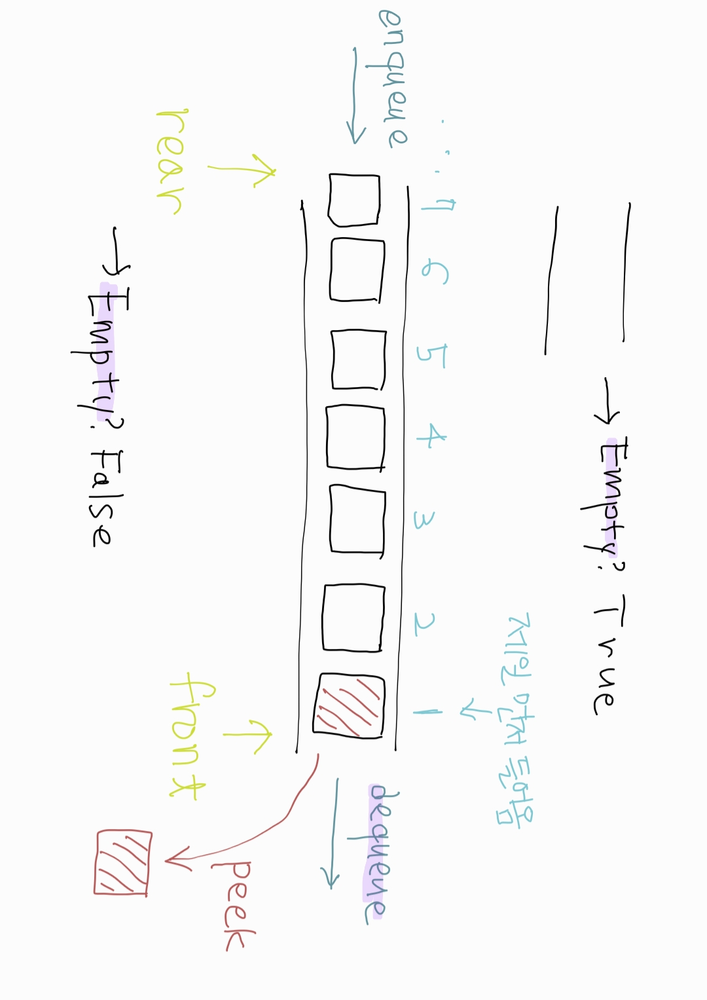
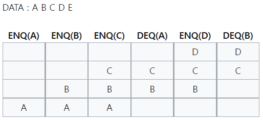
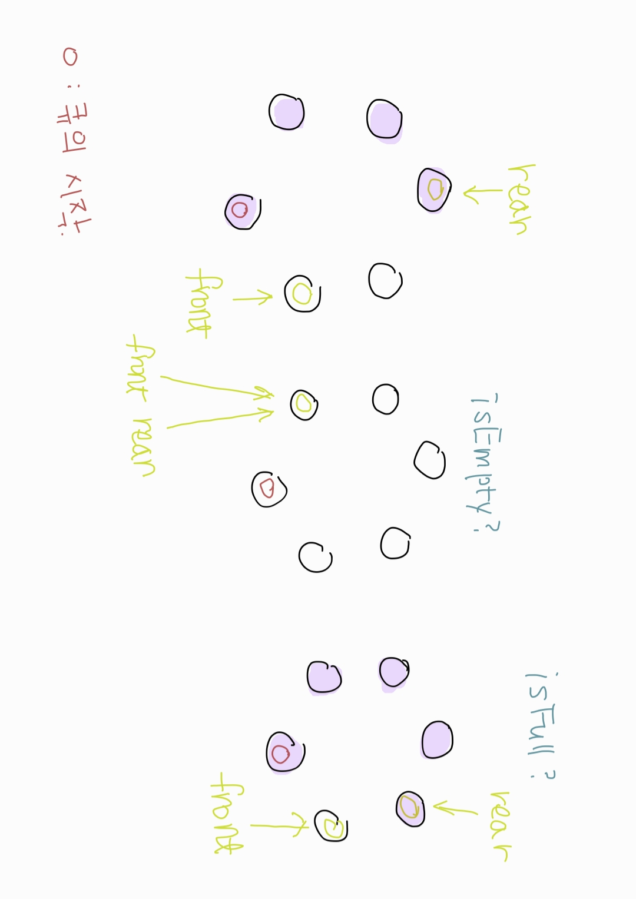
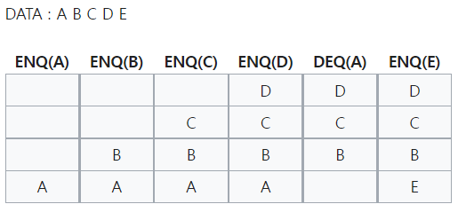

# 큐

2022.02.14

참고자료

- [파이썬으로 구현하는 자료구조! - 큐(Queue)](https://somjang.tistory.com/entry/%ED%8C%8C%EC%9D%B4%EC%8D%AC%EC%9C%BC%EB%A1%9C-%EA%B5%AC%ED%98%84%ED%95%98%EB%8A%94-%EC%9E%90%EB%A3%8C%EA%B5%AC%EC%A1%B0-%ED%81%90-Queue)
- [위키백과-큐 (자료 구조)](https://ko.wikipedia.org/wiki/%ED%81%90_(%EC%9E%90%EB%A3%8C_%EA%B5%AC%EC%A1%B0))
- [큐(Queue)와 원형큐(Circular Queue) 개념과 구현](https://reakwon.tistory.com/30)


## 1단계 : 자료구조의 목적과 이론 이해

- 큐(queue)는 컴퓨터의 기본적인 자료 구조의 한가지고, 먼저 집어 넣은 데이터가 먼저 나오는 FIFO(First In First Out)구조로 저장하는 형식을 말한다.
- 프린터의 출력 처리, 윈도 시스템의 메세지 처리기, 프로세스 관리 등 데이터가 입력된 시간 순서대로 처리해야 할 필요가 있는 상황에 이용된다.


- 선형과 환형(원형)

  - 선형 큐 : 막대 모양으로 된 큐이다. 크기가 제한되어 있고 빈 공간을 사용하려면 모든 자료를 꺼내거나 자료를 한 칸씩 옮겨야 한다는 단점이 있다.

    

    - Front : 데이터의 앞부분

    - Rear : 데이터의 뒷부분

      > 데이터는 Rear로 들어와서 Front로 나간다.

      

    - Method
      - enqueue : 데이터를 삽입하는 과정
      - dequeue : 가장 먼저 삽입한 데이터를 빼서 사용하는 과정. 큐가 비어있는지 먼저 확인한 후에 실행한다.
      - peek : Front 위치에 있는 데이터를 꺼내지 않고 어떤 값인지 return하는 method
      - isEmpty : 현재 큐가 비어있는지 확인하는 method

    

    - 선형 큐의 작동 방식

      

    

    

    

  - 환형(원형) 큐 : 선형 큐의 문제점(배열로 큐를 선언할 시 큐의 삭제와 생성이 계속 일어났을 때, 마지막 배열에 도달 후 실제로는 데이터공간이 남아있지만 오버플로우가 발생)을 보완한 것이 환형 큐이다. front가 큐의 끝에 닿으면 큐의 맨 앞으로 자료를 보내어 원형으로 연결하는 방식이다. 큐를 원형으로 생각해야 하기 때문에 모듈러 연산(나머지 연산)이 필요하다.

    

    

    - 큐의 시작점은 어느 점이어도 된다. 색이 칠해져 있는 부분은 노드가 삽입된 상태이다.
    - front가 노드를 가리키지 않은 이유는 환형 큐에서는 우선 증가 연산 후에 데이터를 꺼내오기 때문이다.

    

    - Method

      - isEmpty : 처음 큐의 rear와 front는 같은 자리에 위치하게 된다. 따라서, 큐가 비어 있다면 rear와 front값이 같아지므로 isEmpty 여부를 rear == front 로 알 수 있게 된다. 큐가 삽입되고 꺼내어질 때에도 마찬가지로 front를 하나 증가하고 난 이후에 데이터를 꺼내오므로 같은 방식으로 isEmpty 여부를 알 수 있다.
      - isFull : 큐에 데이터가 꽉 차있는지 알아보는 연산이다. rear를 하나 증가시키고 데이터를 넣었을 때 그 자리에 front가 있을 경우를 의미합니다. 이 때, 큐에서 1개는 쓸 수 없는 것을 이용하여, rear+1 자리에 front가 있는지 확인하는 방식으로 isFull 여부를 알 수 있다.

      

    - 환형 큐의 작동 방식

      


## 2단계 : 자료구조의 구현 로직 따라가기

- 선형 큐 Python List로 구현하기

  ```python
  class Queue():
      def __init__(self):
          self.queue = []
          
      def enqueue(self, data):
          self.queue.append(data)
          
      def dequeue(self):
          dequeue_object = None
          if self.isEmpty():
              print("Queue is Empty")
          else:
              dequeue_object = self.queue[0]
              self.queue = self.queue[1:]
          
          return dequeue_object
      
      def peek(self):
          peek_object = None
          if self.isEmpty():
              print("Queue is Empty")
          else:
              peek_object = self.queue[0]
              
          return peek_object
      
      def isEmpty(self):
          is_empty = False
          if len(self.queue) == 0:
              is_empty = True
          return is_empty
  ```

  

- 선형 큐 Python Singly Linked List로 구현하기

  ```pytho
  class Node:
      def __init__(self, data):
          self.data = data
          self.next = None
          
  class LinkedListQueue():
      def __init__(self):
          self.front = None
          self.rear = None
          
      def enqueue(self, data):
          new_node = Node(data)
          
          if self.front is None:
              self.front = new_node
              self.rear = new_node
          else:
              self.rear.next = new_node
              self.rear = self.rear.next
              
      def dequeue(self):
          dequeue_object = None
          if self.isEmpty():
              print("Queue is Empty")
          else:
              dequeue_object = self.front.data
              self.front = self.front.next
              
          if self.front is None:
              self.rear = None
          return  dequeue_object
      
      def peek(self):
          front_object = None
          if self.isEmpty():
              print("Queue is Empty")
          else:
              front_object = self.front.data
          return  front_object
      
      def isEmpty(self):
          is_empty = False
          if self.front is None:
              is_empty = True
          return is_empty
  ```

  


## 3단계 : 자료구조의 형태와 오퍼레이션 직접 구현하기

